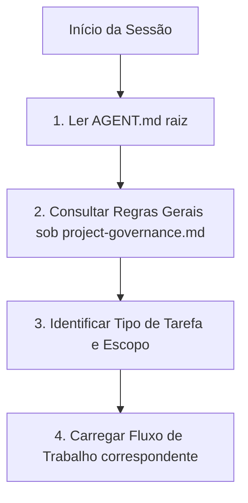

# Guia de Inicialização do Agente de IA (Mecanismo de Inicialização)

> [!IMPORTANT]
> **PONTO DE ENTRADA OBRIGATÓRIO:** Este documento é o inicializador técnico oficial e a primeira etapa obrigatória de integração para qualquer agente de inteligência artificial (IA) que opere sobre este repositório. Nenhuma ação, leitura de memória, fluxos de trabalho, documentação ou modificação de código-fonte deve ser executada sem antes concluir a leitura deste guia.

---

## 🎯 1. Propósito da Arquitetura de Agentes

A arquitetura de agentes foi projetada para estabelecer uma infraestrutura autossuficiente e portátil de governança, memória e automação para agentes de IA dentro do plugin **Gerador de Posts (IA)**. Seu objetivo é garantir a previsibilidade sintática, a integridade dos princípios arquiteturais permanentes e a separação conceitual estrita de conhecimentos durante todas as sessões de desenvolvimento.

---

## 📂 2. Localização das Fontes Oficiais

Toda a inteligência de governança e histórico do ecossistema do plugin reside exclusivamente sob as seguintes pastas estruturais:

*   **Regras Normativas:** [.agents/rules/](.agents/rules/) (Regras permanentes e hierarquia de autoridade).
*   **Memória Persistente:** [.agents/memory/](.agents/memory/) (Snapshots de status executivo e histórico de decisões).
*   **Fluxos de Trabalho Operacionais:** [.agents/workflows/](.agents/workflows/) (Roteiros operacionais lógicos de tarefas e validações).
*   **Prompts Estruturados:** [.agents/prompts/](.agents/prompts/) (Templates de parâmetros operacionais reutilizáveis).
*   **Relatórios Técnicos:** [.agents/reports/](.agents/reports/) (Artefatos de saída e registros de validação de garantia de qualidade).
*   **Manual do Desenvolvedor (Humano):** [docs/](docs/) (Manuais de engenharia, guias de publicação e de manutenção para desenvolvedores humanos).

---

## 👑 3. Hierarquia de Autoridade

Nas tomadas de decisão e em caso de eventuais conflitos normativos, o agente de IA deve respeitar estritamente a prioridade de documentos definida na Hierarquia de Autoridade contida em [project-governance.md](.agents/rules/project-governance.md). Nenhuma regra de tomada de decisão ou prioridade sintática deve ser extraída deste inicializador.

---

## 🚦 4. Roteiro Inicial de Integração para Agentes

Ao iniciar uma nova sessão ou receber qualquer requisição de usuário, o agente de IA deve executar rigorosamente a seguinte sequência inicial de carregamento de contexto:

### Detalhamento das Etapas:
1.  **Leitura do Inicializador:** Ler este arquivo ([AGENT.md](AGENT.md)) para situar-se nas convenções e caminhos físicos do repositório.
2.  **Carregamento de Regras Gerais**: Consultar as normas permanentes e de autoridade em [project-governance.md](.agents/rules/project-governance.md) para compreender os limites operacionais permitidos.
3.  **Identificação do Escopo da Tarefa**: Classificar a requisição e identificar quais arquivos pertencem ao escopo direto de intervenção.
4.  **Carregamento do Fluxo de Trabalho correspondente:**
    *   Para auditorias de arquitetura ou encerramento de fases, utilizar o fluxo de auditoria ([audit-execution.md](.agents/workflows/audit-execution.md)).
    *   Para desenvolvimento de funcionalidades, utilizar o fluxo de desenvolvimento ([plugin-development.md](.agents/workflows/plugin-development.md)).
    *   Para correção de erros ou diagnósticos, utilizar o fluxo de validação ([qa-validation.md](.agents/workflows/qa-validation.md)).
    *   Para publicações de produção, utilizar o fluxo de publicação ([plugin-release.md](.agents/workflows/plugin-release.md)).

---

## 🛑 5. Abertura Obrigatória de Portal Socrático

O agente de IA está **terminantemente obrigado** a interromper a execução física do seu turno e abrir um **Portal Socrático** (canal de alinhamento interativo com o usuário) antes de realizar qualquer alteração se constatar:
*   Qualquer ambiguidade estrutural nas premissas da tarefa.
*   Conflito de autoridade evidente entre regras ou com a documentação de `docs/`.
*   Existência de mais de uma alternativa técnica válida para resolver a tarefa.
*   Necessidade de alteração de caminhos físicos de diretórios ou modificação de princípios supremos de governança.
*   Divergência entre o snapshot de memória (`project-status.md`) e os arquivos versionados no Git.
