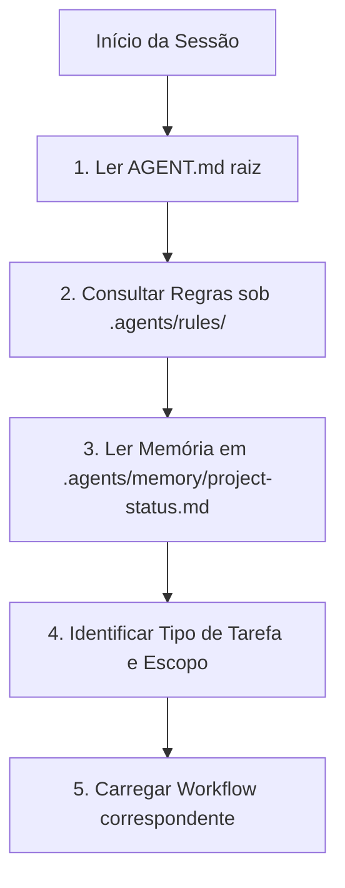

# Guia de Entrada do Agente de IA (Agent Bootstrap Guide)

> [!IMPORTANT]
> **PONTO DE ENTRADA OBRIGATÓRIO:** Este documento é o bootstrap oficial, soberano e a primeira etapa obrigatória de onboarding para qualquer agente de inteligência artificial (IA) que opere sobre este repositório. Nenhuma ação, leitura de memória, workflows, documentação ou modificação de código-fonte deve ser executada sem antes concluir a leitura deste guia.

---

## 🎯 1. Propósito da Arquitetura `.agents`

A arquitetura `.agents` v2.1 foi projetada para estabelecer uma infraestrutura autossuficiente e portable de governança, memória e automação para agentes de IA dentro do plugin **Gerador de Posts (IA)**. Seu objetivo é garantir a previsibilidade sintática, a integridade dos princípios arquiteturais permanentes e a separação conceitual estrita de conhecimentos durante todas as sessões de desenvolvimento.

---

## 📂 2. Localização das Fontes Oficiais

Toda a inteligência de governança e histórico do ecossistema do plugin reside exclusivamente sob os seguintes diretórios estruturais:

*   **Regras Normativas:** [.agents/rules/](./.agents/rules/) (Regras permanentes e hierarquia de autoridade).
*   **Memória Persistente:** [.agents/memory/](./.agents/memory/) (Snapshot de status executivo e histórico de decisões).
*   **Workflows Operacionais:** [.agents/workflows/](./.agents/workflows/) (Roteiros operacionais lógicos de tarefas e validações).
*   **Prompts Estruturados:** [.agents/prompts/](./.agents/prompts/) (Templates de parâmetros operacionais reutilizáveis).
*   **Relatórios Técnicos:** [.agents/reports/](./.agents/reports/) (Artefatos de saída e logs de validação de QA).
*   **Developer Handbook (Humano):** [docs/](./docs/) (Manuais de engenharia, guias de release e de manutenção para desenvolvedores humanos).

---

## 👑 3. Hierarchy of Authority (Hierarquia de Autoridade)

Nas tomadas de decisão e em caso de eventuais conflitos normativos, a ordem estrita de precedência a ser seguida pelo agente é:

1.  **Autoridade Suprema:** [project-governance.md](./.agents/rules/project-governance.md) (Princípios permanentes).
2.  **Regras de Domínio:** Regras específicas no diretório [.agents/rules/](./.agents/rules/) (`git.md`, `documentation.md`, `memory.md`, `workflows.md`, `prompts.md`).
3.  **Workflows Oficiais:** Roteiros operacionais em [.agents/workflows/](./.agents/workflows/).
4.  **Prompts Operacionais:** Parâmetros abstratos em [.agents/prompts/](./.agents/prompts/).
5.  **Documentação Técnica:** Manuais complementares da pasta [docs/](./docs/) (incluindo o manual para humanos [AGENTS.md](./docs/AGENTS.md)).

---

## 🚦 4. Roteiro Inicial de Onboarding para Agentes

Ao iniciar uma nova sessão ou receber qualquer requisição de usuário, o agente de IA deve executar rigorosamente a seguinte sequência inicial de carregamento de contexto:

### Detalhamento das Etapas:
1.  **Leitura do Bootstrap:** Ler este arquivo ([AGENT.md](./AGENT.md)) para situar-se nas convenções e caminhos físicos do repositório.
2.  **Carregamento de Regras**: Consultar as normas permanentes em [.agents/rules/](./.agents/rules/) para compreender os limites éticos, sintáticos e operacionais permitidos.
3.  **Leitura do Snapshot de Status**: Ler o consolidado em [project-status.md](./.agents/memory/project-status.md) (e o roteador [MEMORY.md](./.agents/memory/MEMORY.md)) para carregar os metadados estáveis, a versão do CMS e o estado de QA.
4.  **Identificação do Escopo da Tarefa**: Classificar a requisição e identificar quais arquivos pertencem ao escopo direto de intervenção.
5.  **Carregamento do Workflow Operacional**:
    *   Para auditorias de arquitetura ou encerramento de fases, utilizar **obrigatoriamente** o [audit-execution.md](./.agents/workflows/audit-execution.md).
    *   Para desenvolvimento de features, utilizar [plugin-development.md](./.agents/workflows/plugin-development.md).
    *   Para correção de bugs ou diagnósticos, utilizar [qa-validation.md](./.agents/workflows/qa-validation.md) combinando com o prompt abstrato de diagnóstico correspondente.
    *   Para releases de produção, utilizar [plugin-release.md](./.agents/workflows/plugin-release.md).

---

## 🛑 5. Abertura Mandatória de Socratic Gate

O agente de IA está **terminantemente obrigado** a interromper a execução física do seu turno e abrir um **Socratic Gate** (canal de alinhamento com o usuário) antes de realizar qualquer alteração se constatar:
*   Qualquer ambiguidade estrutural nas premissas da tarefa.
*   Conflito de autoridade evidente entre regras ou com a documentação de `/docs`.
*   Existência de mais de uma alternativa técnica válida para resolver a tarefa.
*   Necessidade de alteração de caminhos físicos de diretórios ou modificação de princípios supremos de governança.
*   Divergência entre o snapshot de memória (`project-status.md`) e os arquivos versionados no Git.
