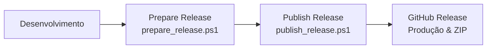

# Pipeline Oficial de Release — Manual de Operação

Este manual descreve a arquitetura, o fluxo de execução e a interface de console do **Pipeline Oficial de Release** do plugin **Gerador de Posts (IA)**.

---

## 🛠️ 1. Arquitetura e Fluxo do Pipeline

O processo operacional de publicação do ecossistema é consolidado em **duas etapas ativas** de execução, garantindo automação total e segurança em ambiente de produção:



### Fluxo Operacional Oficial (2 Etapas)

1.  **Etapa 1: `prepare_release.ps1` (Preparação e Build):**
    *   Valida sintaxe da versão (`MAJOR.MINOR.PATCH`).
    *   Substitui de forma automática a versão corrente no cabeçalho do plugin, em constantes e em arquivos operacionais.
    *   **Sincronização do readme.txt (WordPress):** Atualiza de forma automática as strings `Stable tag` e `Version` no arquivo `readme.txt` (utilizado pelo Plugin Update Checker no ecossistema WordPress) para garantir integridade e eliminar manutenção manual do arquivo de metadados.
    *   **Consolidação de Release Notes Dinâmica:** Varre de forma automática a pasta `docs/releases/` identificando todos os relatórios técnicos oficiais que mencionam a versão corrente. Extrai o conteúdo contido sob a seção `## Resumo para Release` de cada relatório, agrupa e categoriza os itens (Novidades, Melhorias, Correções, Segurança, Documentação, Arquitetura), eliminando duplicidades, e insere esse bloco consolidado no `CHANGELOG.md` sem textos fixos.
    *   Invoca automaticamente o script de build para geração e validação estrutural do ZIP.
2.  **Etapa 2: `publish_release.ps1` (Publicação e Sincronização):**
    *   Audita a árvore de trabalho (`git status --porcelain`) através de uma validação arquitetural baseada em categorias oficiais permitidas (documentações, scripts do pipeline, manifesto do plugin, bootstrap e subsistema de updater), eliminando a necessidade de listas estáticas manuais e protegendo a Working Tree contra modificações indevidas.
    *   Comita as alterações administrativas permitidas e as documentações geradas.
    *   Gera a tag semântica local (`vMAJOR.MINOR.PATCH`).
    *   Sincroniza commits e tags com a branch remota `main`.
    *   **Release Notes Unificada (Single Source of Truth):** Localiza e extrai de forma 100% automatizada a seção correspondente da versão no `CHANGELOG.md` e a utiliza como corpo da release gerada no GitHub via GitHub CLI (`gh`), mantendo a sincronização entre os relatórios locais, o CHANGELOG.md e o painel remoto. Todo o fluxo de leitura, gravação do arquivo temporário e publicação utiliza codificação UTF-8 explícita de ponta a ponta, com validação round-trip de integridade para blindar acentos, cedilhas e símbolos markdown.
    *   Efetua o upload do ZIP validado.
    *   Executa testes de integridade de pós-deploy.

### Ferramenta Técnica Complementar

*   **`build_release.ps1` (Build e Validação Estrutural):** Permanecerá exclusivamente como uma ferramenta técnica complementar do pipeline, de uso restrito a manutenção, testes estruturais locais ou reconstruções pontuais manuais do pacote ZIP. Ele **não** faz parte das etapas ativas operacionais executadas pelo operador, que dispara exclusivamente `prepare_release.ps1` e depois `publish_release.ps1`.

---

## ⚙️ 2. Instalação e Validação do GitHub CLI (gh)

Para automatizar totalmente a publicação de releases e o upload do pacote ZIP no GitHub, o utilitário GitHub CLI deve estar configurado no sistema.

*   **Windows (Método Oficial Principal):**
    ```powershell
    winget install --id GitHub.cli
    ```
*   **Instalação Manual (Alternativa):** Baixe o instalador executável diretamente em [cli.github.com](https://cli.github.com/).
*   **Autenticação:** Após instalar, execute `gh auth login` no terminal e autentique sua conta.

### Validação e Execução de Comandos Externos
Para certificar a resiliência técnica em ambientes de integração heterogêneos, todas as validações e execuções de comandos externos do Git e do GitHub CLI (`gh`) no pipeline utilizam estritamente os códigos de retorno de execução do terminal (`$LASTEXITCODE`), por meio de uma função auxiliar reutilizável (`Execute-ExternalCommand`) declarada no próprio script.

Isso engloba checagens e operações como `git status`, `git add`, `git commit`, `git push`, `git tag`, `gh auth status`, `gh repo view`, `gh release view`, `gh release create` e `gh release upload`. Essa arquitetura elimina qualquer dependência de redirecionamentos de saída complexos (como `2>&1`) ou de parsing textual da saída dos comandos, tornando o pipeline 100% independente de idioma, tradução do console, versão ou formatação textual das ferramentas Git e GitHub CLI.

---

## 🚦 3. Interface de Console (ASCII Padrão)

Para assegurar compatibilidade universal com qualquer plataforma e sistema operacional (PowerShell, CMD, bash, GitHub Actions, Linux/macOS), toda a interface de console foi construída em codificação de texto ASCII sem dependência de caracteres Unicode complexos ou acentuações.

As mensagens do terminal seguem obrigatoriamente a seguinte taxonomia:
*   `[OK]`: Sucesso em testes, validações e ações do Git.
*   `[INFO]`: Mensagens explicativas e de progresso operacional.
*   `[WARN]`: Avisos secundários de atenção.
*   `[ERRO]`: Erros de integridade que abortam imediatamente a execução.

---

## 📊 4. Painéis de Fechamento do Pipeline

Ao concluir a publicação com sucesso, o console exibe dois painéis estruturados de resumo e validação:

### RESUMO FINAL DA RELEASE
```
==================================================
RESUMO FINAL DA RELEASE
==================================================
Versao Publicada   : v2.0.1
Branch             : main
Commit             : 2862210...
Tag Git            : v2.0.1
Caminho ZIP Gerado : build/gerador-posts-gemini.zip
Status Validacao   : APROVADA [OK]
Status do Push     : CONCLUIDO [OK]
Status da GH Rel   : v2.0.1 [APROVADA]
URL da Release     : https://github.com/tdvieira/gerador_posts/releases/tag/v2.0.1
Data e Hora Pub    : 2026-07-27 10:15:00
Status Final       : PUBLICADO COM SUCESSO [OK]
==================================================
```

### PIPELINE OFICIAL DE RELEASE FINALIZADO
```
==================================================
PIPELINE OFICIAL DE RELEASE FINALIZADO
==================================================
Versao         : v2.0.1 [APROVADA]
ZIP            : build/gerador-posts-gemini.zip [APROVADO]
Git            : branch main [APROVADO]
Tag            : v2.0.1 [APROVADA]
Release GitHub : v2.0.1 [APROVADA]
Working Tree   : Limpa [OK]
==================================================
PUBLICACAO CONCLUIDA COM SUCESSO
==================================================
```
