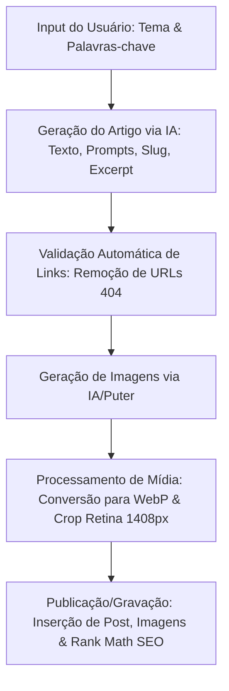

# Gerador de Posts (IA) — Plugin WordPress

O **Gerador de Posts (IA)** é um plugin WordPress de nível profissional projetado para automatizar a criação, otimização e publicação de artigos de alta fidelidade visual e estrutural utilizando múltiplos provedores de Inteligência Artificial. Ele gera artigos estruturados com sumários (TOC), imagens em resoluções Retina e WebP, links contextuais dinâmicos e integração nativa com o Rank Math SEO.

---

## 🎯 Objetivo

O objetivo principal deste plugin é reduzir drasticamente o tempo necessário para criar e formatar conteúdos otimizados para blogs WordPress, integrando a escrita de artigos por inteligência artificial diretamente à biblioteca de mídias e painel do CMS, mantendo um alto padrão editorial e de SEO.

---

## 💎 Principais Benefícios

*   **Economia de Tempo:** Reduz o fluxo de escrita, formatação e publicação de um post completo de horas para menos de 2 minutos.
*   **SEO On-page Impecável:** Metadados estruturados, links limpos e integração direta com o Rank Math que auxiliam no ranqueamento no Google.
*   **Qualidade Visual Superior:** Garante que todas as imagens fiquem consistentes, no formato moderno WebP e com alta definição para telas Retina.
*   **Segurança e Resiliência:** Proteção contra downloads maliciosos e tratamento robusto de timeouts caso as APIs externas oscilem.

---

## 🔄 Fluxo de Geração de Conteúdo

O fluxo abaixo ilustra como o plugin orquestra a inteligência artificial, validações de segurança e gravação de mídias:



---

## 🚀 Principais Funcionalidades

*   **Orquestração de Múltiplas APIs de IA:** Suporte nativo para **Google Gemini** (Gemini 3.5 Flash, Gemini 3.1 Pro/Flash-Lite), **OpenAI** (GPT-4o, GPT-4o-mini, o1-mini) e **Groq Cloud** (Llama 3.3 70B, Llama 3.1 8B, Gemma 2).
*   **Geração Inteligente de Imagens:** Criação de imagens widescreen (16:9) utilizando **OpenAI DALL-E 3**, **Google Imagen 4** (via predict) e **Flux/Flux-Anime** (via Pollinations.ai ou SDK frontend Puter.js).
*   **Processamento Otimizado de Mídia:**
    *   **Conversão para WebP:** Conversão automática de imagens externas ou payloads Base64 para o formato `.webp` com nível de qualidade em 90%.
    *   **Suporte a Monitores Retina:** Redimensionamento e crop de imagens gerando dimensões de alta definição (Destaque em `1408x474px` e imagens do corpo do post em `1408x792px`).
*   **Otimização SEO de Alta Performance:** Injeção automática das palavras-chave de foco e metadados de descrição na tabela `wp_postmeta` integrada nativamente com as chaves oficiais do **Rank Math SEO**.
*   **Limpeza & Sanitização de Conteúdo:** Algoritmos dedicados via expressões regulares para remoção de quebras extras de parágrafos, ajuste de placeholders, sumários de conteúdo sem cabeçalhos órfãos e remoção automática de links com resposta HTTP 404 (páginas inexistentes).
*   **Sistema de Cache por Transients:** Redução de consultas repetidas ao banco de dados MySQL via armazenamento temporário por 12 horas dos links contextuais e do pool de posts recomendados (caixa "Veja Também" com array aleatório no PHP).
*   **Segurança Avançada (Zero Trust):**
    *   **Prevenção contra SSRF:** Validação de URLs externas de download de imagens via `wp_http_validate_url()` para evitar varredura de intranet.
    *   **Validação Condicional de SSL:** Verificação de segurança SSL (`sslverify`) obrigatória em ambientes de homologação e produção, desativada apenas em hosts de desenvolvimento local (`local` e `development`).
    *   **Controle de Acesso:** Proteção estrita contra CSRF por meio de Nonces e Capabilities (`manage_options`) em todos os endpoints AJAX.

---

## 📐 Arquitetura e Estrutura de Diretórios

O plugin segue uma arquitetura modularizada, separando as camadas de estilos, lógica interativa de frontend, templates HTML da view e controladores PHP do backend:

```
gerador-posts-gemini/
├── assets/
│   ├── css/
│   │   ├── admin.css       # Estilos visuais Outfit da interface administrativa
│   │   └── frontend.css    # Estilizações aplicadas aos artigos (Veja Também/TOC)
│   └── js/
│       └── admin.js        # Lógica de controle AJAX, abas e pipeline de progresso
├── admin-ui.php            # View/Interface HTML do painel administrativo
└── gerador-posts-gemini.php # Controlador principal do plugin (Hooks, AJAX, APIs)
```

---

## 🛠️ Requisitos de Instalação

*   **WordPress:** 5.8 ou superior (Testado até WordPress 7.0.2).
*   **PHP:** 8.0 ou superior (Testado no PHP 8.2.29) com extensões `gd` ou `imagick` ativas para processamento de imagem.
*   **Dependências:** Plugin **Rank Math SEO** ativo (opcional, para injeção automática de metadados).

---

## ⚙️ Configuração

1.  Acesse o painel do WordPress, vá em **Plugins > Adicionar Novo** e faça o upload do arquivo ZIP do plugin.
2.  Ative o plugin. Ao ativar, as 8 categorias oficiais do blog serão criadas automaticamente se não existirem.
3.  Vá em **Posts > Gerador de Posts** no menu lateral.
4.  Acesse a aba **Configurações** e insira as suas chaves de API correspondentes (Gemini, OpenAI, Groq ou Puter Token). As chaves serão salvas de forma segura e mascaradas na interface.

---

## 🚀 Utilização

### Geração Individual
1.  Insira o tema do artigo no campo principal.
2.  Selecione o Provedor de Texto e o Modelo desejado.
3.  Forneça as palavras-chave (separadas por vírgula).
4.  Defina o tom de escrita, comprimento do artigo e categoria de publicação.
5.  Clique em **Gerar Artigo**.
6.  Acompanhe a geração assíncrona. Ao final, a interface de pré-visualização carregará o título, slug sugerido, corpo formatado, excerpt e prompts sugeridos de imagem.
7.  Clique em **Gerar Imagem 1** (Destaque) e **Gerar Imagem 2** (Corpo).
8.  Configure a data de publicação e o status (Rascunho, Agendado ou Publicado) e clique em **Salvar Post**.

### Geração em Lote
1.  Acesse a aba **Agendador em Lote**.
2.  Selecione os provedores de texto/imagem e insira uma lista de temas (um por linha).
3.  Clique em **Iniciar Lote**. Acompanhe visualmente o pipeline sequencial de progresso por tema (Interpretação, Segurança, Escrita, Revisão, Imagens, Publicação e Conclusão).

---

## 📄 Licença

Este software é um produto comercial e possui **Licença Proprietária**. É proibida a redistribuição, cópia ou modificação não autorizada do código fora do escopo estabelecido pelo proprietário dos direitos autorais.

---

## ✍️ Autor

*   **Thiago Vieira** - *Criação e Arquitetura* - contato@tdvieiradesign.com
