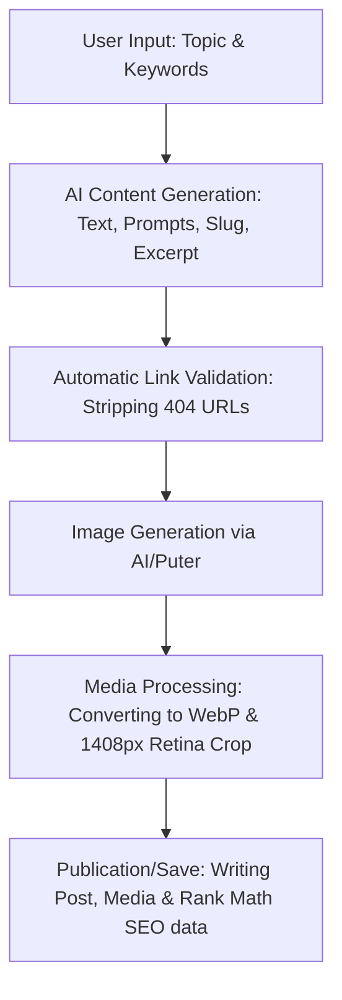

# AI Post Generator — WordPress Plugin

The **AI Post Generator** is a professional-grade WordPress plugin designed to automate the creation, optimization, and publication of high-fidelity, visually rich articles using multiple Artificial Intelligence providers. It generates structured posts complete with Tables of Contents (TOC), Retina-ready WebP images, dynamic contextual linking, and native Rank Math SEO integration.

---

## 🎯 Objective

The main objective of this plugin is to drastically reduce the time needed to create and format SEO-optimized content for WordPress blogs, integrating AI-driven content generation directly with the WordPress media library and CMS dashboard while maintaining top-tier editorial and SEO standards.

---

## 💎 Key Benefits

*   **Time-saving:** Cuts down the writing, formatting, and publication workflow of a complete article from hours to under 2 minutes.
*   **Impeccable On-page SEO:** Structured metadata, clean link profiles, and direct integration with Rank Math SEO to boost Google rankings.
*   **Superior Visual Quality:** Ensures all images are highly consistent, output in the modern WebP format, and razor-sharp on Retina high-definition displays.
*   **Security & Resilience:** Inherent protection against malicious downloads (SSRF protection) and robust timeout handling in case of external API delays.

---

## 🔄 Content Generation Flow

The diagram below illustrates how the plugin orchestrates AI resources, security validation checks, and media processing:



---

## 🚀 Key Features

*   **Multi-Provider AI Orchestration:** Native support for **Google Gemini** (Gemini 3.5 Flash, Gemini 3.1 Pro/Flash-Lite), **OpenAI** (GPT-4o, GPT-4o-mini, o1-mini), and **Groq Cloud** (Llama 3.3 70B, Llama 3.1 8B, Gemma 2).
*   **Intelligent Image Generation:** Widescreen (16:9) image creation powered by **OpenAI DALL-E 3**, **Google Imagen 4** (via predict), and **Flux/Flux-Anime** (via Pollinations.ai or the frontend Puter.js SDK).
*   **Optimized Media Processing:**
    *   **WebP Conversion:** Automatically converts external source images or Base64 payloads into the `.webp` format at 90% quality level.
    *   **Retina Display Support:** Resizes and crops images into high-definition dimensions (Featured image at `1408x474px` and in-post body images at `1408x792px`).
*   **High-Performance SEO Optimization:** Automatically injects focus keywords and meta descriptions into the `wp_postmeta` table using official **Rank Math SEO** meta keys.
*   **Content Sanitization & Cleaning:** Dedicated Regex-based algorithms remove redundant line breaks, handle image placeholders, strip orphans from the Table of Contents, and auto-remove broken links (HTTP 404 responses).
*   **Transients Caching System:** Reduces database load by caching contextual link lists and the "You May Also Like" recommended posts pool for 12 hours (with randomized selection handled in PHP).
*   **Advanced Security (Zero Trust):**
    *   **SSRF Prevention:** Validates external image URLs via `wp_http_validate_url()` before initiating downloads to prevent local network scanning.
    *   **Conditional SSL Validation:** Strictly enforces SSL verification (`sslverify`) on staging and production environments, disabling it only on local development hosts (`local` and `development`).
    *   **Access Control:** Full CSRF protection using Nonces and Capability checks (`manage_options`) across all AJAX endpoints.

---

## 📐 Architecture & Directory Structure

The plugin follows a modular architecture, separating styles, interactive frontend logic, HTML views, and backend PHP controllers:

```
gerador-posts-gemini/
├── assets/
│   ├── css/
│   │   ├── admin.css       # Administrative interface layout & typography styles
│   │   └── frontend.css    # Post layout styles (TOC, recommended posts boxes)
│   └── js/
│       └── admin.js        # AJAX control, tab logic, and progress pipeline scripts
├── admin-ui.php            # Administrative panel HTML template (View)
└── gerador-posts-gemini.php # Main plugin controller (Hooks, AJAX, API calls)
```

---

## 🛠️ Requirements & Installation

*   **WordPress:** 5.8 or higher (Tested up to WordPress 7.0.2).
*   **PHP:** 8.0 or higher (Tested on PHP 8.2.29) with `gd` or `imagick` extensions enabled for image editing.
*   **Dependencies:** Active **Rank Math SEO** plugin (optional, for automatic metadata mapping).

---

## ⚙️ Configuration

1.  Access the WordPress dashboard, navigate to **Plugins > Add New**, and upload the plugin's ZIP archive.
2.  Activate the plugin. Upon activation, the 8 standard blog categories will be created automatically if they do not exist.
3.  Go to **Posts > Gerador de Posts** on the sidebar.
4.  Navigate to the **Configurações** (Settings) tab and insert your API keys (Gemini, OpenAI, Groq, or Puter Token). Keys will be saved securely and masked in the UI.

---

## 🚀 Usage

### Single Post Generation
1.  Enter the article topic in the main field.
2.  Select the Text Provider and Model.
3.  Provide focus keywords (separated by commas).
4.  Define writing tone, article length, and publication category.
5.  Click **Gerar Artigo** (Generate Article).
6.  Monitor asynchronous generation. The preview pane will display the title, slug, body content, excerpt, and image prompts.
7.  Click **Gerar Imagem 1** (Featured Image) and **Gerar Imagem 2** (Body Image).
8.  Set the publication date and status (Draft, Scheduled, or Published) and click **Salvar Post** (Save Post).

### Batch Generation
1.  Navigate to the **Agendador em Lote** (Batch Scheduler) tab.
2.  Select the text/image providers and enter a list of topics (one per line).
3.  Click **Iniciar Lote** (Start Batch). Monitor the pipeline progress in real-time (Interpretation, Security, Writing, Review, Images, Publishing, and Complete).

---

## 📄 License

This software is a commercial product under a **Proprietary License**. Any unauthorized redistribution, copying, or modification of this code outside the scope defined by the copyright holder is strictly prohibited.

---

## ✍️ Author

*   **Thiago Vieira** - *Creation & Architecture* - contato@tdvieiradesign.com
