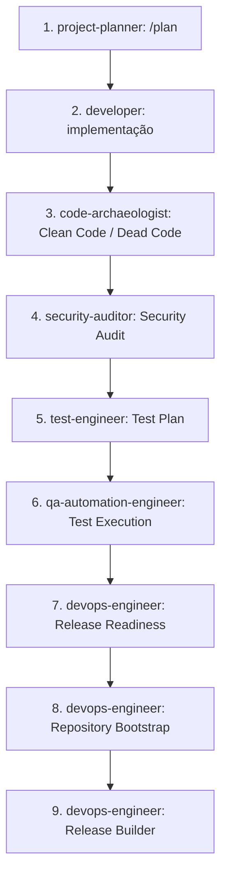

# Manual de Agentes e Auditorias (Agents & Audits Manual) — v1.0.0

Este documento cataloga todos os agentes inteligentes, workflows operacionais e processos de auditoria aplicados no ciclo de desenvolvimento do plugin **Gerador de Posts (IA)**. Ele detalha os papéis, responsabilidades, dependências e relatórios produzidos por cada engrenagem de controle de qualidade.

---

## 📖 Índice

1. [Funções dos Agentes Especialistas](#-funções-dos-agentes-especialistas)
2. [Workflows de Desenvolvimento e Refatoração](#-workflows-de-desenvolvimento-e-refatoração)
3. [Processos de Auditoria e QA (Quality Assurance)](#-processos-de-auditoria-e-qa-quality-assurance)
4. [Esteira de Execução e Dependências](#-esteira-de-execução-e-dependências)
5. [Resumo dos Artefatos de Auditoria](#-resumo-dos-artefatos-de-auditoria)

---

## 🤖 Funções dos Agentes Especialistas

Cada agente atua sob uma persona estrita e possui escopo operacional isolado:

| Agente | Objetivo e Foco Principal | Ferramentas / Skills Utilizadas |
| :--- | :--- | :--- |
| **`project-planner`** | Concepção, discovery e quebra de tarefas em planos funcionais. | `brainstorming`, `plan-writing`, `architecture` |
| **`documentation-writer`** | Escrita de manuais técnicos, guias de usuário e indexação do Handbook. | `documentation-templates` |
| **`frontend-specialist`** | Modularização de CSS/JS e consistência da UI Outfit com o Elementor. | `frontend-design`, `tailwind-patterns` |
| **`backend-specialist`** | Lógica de controladores PHP, segurança de AJAX e chamadas REST a IAs. | `api-patterns`, `nodejs-best-practices` |
| **`security-auditor`** | Análise e prevenção de vulnerabilidades (OWASP, SSRF, Nonces, SSL). | `vulnerability-scanner`, `red-team-tactics` |
| **`test-engineer`** | Elaboração do plano de testes funcionais e roteiro de homologação. | `testing-patterns`, `webapp-testing` |
| **`debugger`** | Investigação de causa raiz de erros de timeout ou falhas em chamadas AJAX. | `systematic-debugging` |
| **`performance-optimizer`** | Implementação de transients e invalidações para performance web. | `performance-profiling` |

---

## 🔄 Workflows de Desenvolvimento e Refatoração

Os workflows são ativados via comandos barra (`/`) e estruturam as fases operacionais:

### 1. Workflow `/plan` (Planejamento)
*   **Responsável:** `project-planner`
*   **Entrada:** Pedido de nova funcionalidade ou correção de bug.
*   **Saída:** Criação de um plano `{task-slug}.md` na raiz do repositório contendo tarefas unitárias e critérios de verificação.
*   **Propósito:** Evitar implementação ad-hoc sem visibilidade de impacto.

### 2. Workflow `/enhance` (Aprimoramento)
*   **Responsável:** `frontend-specialist` ou `backend-specialist`
*   **Entrada:** Funcionalidade existente no plugin que necessita de melhorias.
*   **Saída:** Refatorações modulares no código-fonte, respeitando a separação de assets (SoC) e princípios SOLID.
*   **Propósito:** Escalonar os recursos do plugin sem quebrar retrocompatibilidade.

### 3. Workflow `/debug` (Depuração)
*   **Responsável:** `debugger`
*   **Entrada:** Relatório de erros no console JS, logs PHP ou timeout HTTP.
*   **Saída:** Diagnóstico de causa raiz e aplicação de hotfixes corretivos focados.
*   **Propósito:** Resolver incidentes operacionais de forma estruturada.

---

## 🔒 Processos de Auditoria e QA (Quality Assurance)

As auditorias representam as etapas de checagem obrigatórias executadas antes do fechamento de qualquer versão:

### 1. Auditoria de Clean Code (Código Limpo)
*   **Objetivo:** Garantir que o código esteja legível, enxuto e sem abstrações desnecessárias.
*   **Ação:** Varre os arquivos para separar trechos inline. Migração de CSS para `/assets/css/admin.css` e JS para `/assets/js/admin.js` aplicando `wp_localize_script()`.
*   **Ordem:** Imediatamente após a fase de implementação.

### 2. Auditoria de Dead Code (Código Morto)
*   **Objetivo:** Eliminar funções declaradas e não referenciadas no plugin, variáveis órfãs e comentários de depuração temporários.
*   **Ação:** Inspeção estática de escopo no arquivo controlador PHP e comportamento JavaScript.
*   **Ordem:** Paralela à auditoria de Clean Code.

### 3. Auditoria do Security Auditor (Segurança)
*   **Objetivo:** Validar as barreiras contra ataques OWASP e exploits específicos do WordPress.
*   **Ação:** Inspecionar Nonces, Capabilities, blindagem contra SSRF no download de imagens (usando `wp_http_validate_url()`) e certificar de que a verificação SSL (`sslverify`) esteja ativa em produção.
*   **Ordem:** Conclusão da fase de Clean Code e antes dos testes de QA.

### 4. Elaboração de Plano de Testes Funcionais (Functional Test Plan)
*   **Objetivo:** Mapear todos os caminhos felizes e fluxos de exceção do plugin.
*   **Ação:** O `test-engineer` elabora cenários detalhados (ex: TF-M1-01 a TF-M7-03) descrevendo ações e o comportamento esperado.
*   **Saída:** Arquivo `functional_test_plan.md` na raiz pública.

### 5. Execução de QA (Functional Testing)
*   **Objetivo:** Validar em tempo de execução real todas as funcionalidades planejadas.
*   **Ação:** Executa os testes mediando bypass de login local com `autologin.php`, gerando posts em lote, simulando indisponibilidades e aferindo transients.
*   **Saída:** Arquivo `functional_test_report.md` detalhando sucessos e evidências de validação.

### 6. Auditoria de Prontidão (Release Readiness)
*   **Objetivo:** Determinar a classificação final da release como apta para publicação.
*   **Ação:** Cruzamento de dados entre o Plano de Testes e o Relatório de Testes. Elaboração da Matriz de Risco e da recomendação técnica final (GO / NO-GO).
*   **Saída:** Arquivo `release_readiness_report.md`.

---

## ⛓️ Esteira de Execução e Dependências

A ordem de atuação de cada agente e a geração de seus respectivos relatórios seguem a ordem de precedência técnica descrita no diagrama de dependências a seguir:

---

## 📄 Resumo dos Artefatos de Auditoria

Durante o ciclo de QA, são gerados relatórios específicos. É dever do Release Builder certificar que estes arquivos residam na raiz do site público local e **nunca** dentro da pasta de distribuição do plugin:

| Artefato | Objetivo Principal | Responsável |
| :--- | :--- | :--- |
| **`functional_test_plan.md`** | Planejamento de cobertura dos cenários de teste funcionais. | `test-engineer` |
| **`functional_test_report.md`** | Registro de evidências de sucesso de execução de testes de QA. | `qa-automation-engineer` |
| **`release_readiness_report.md`** | Auditoria técnica e matriz de risco para decisão de publicação (GO). | `devops-engineer` |
| **`repository_bootstrap_report.md`** | Validação da presença e conformidade dos arquivos de governança. | `devops-engineer` |
| **`release_builder_report.md`** | Histórico das fases de Git Tagging, empacotamento ZIP e status de push. | `devops-engineer` |
| **`distribution_validation_report.md`** | Auditoria de integridade do ZIP, garantindo purga de resíduos de QA. | `devops-engineer` |
