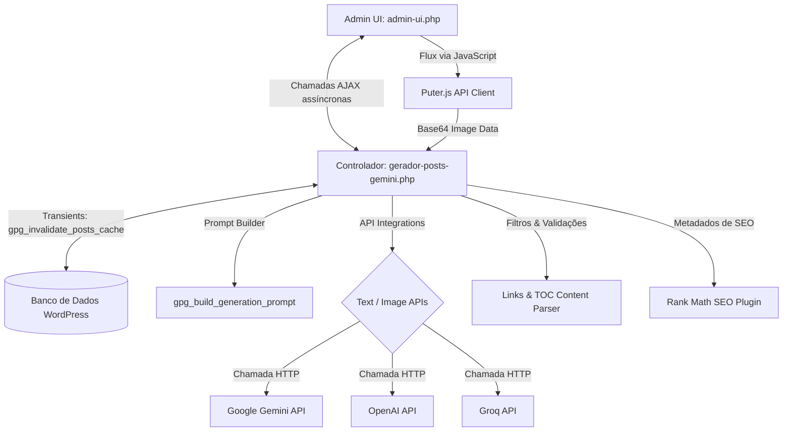
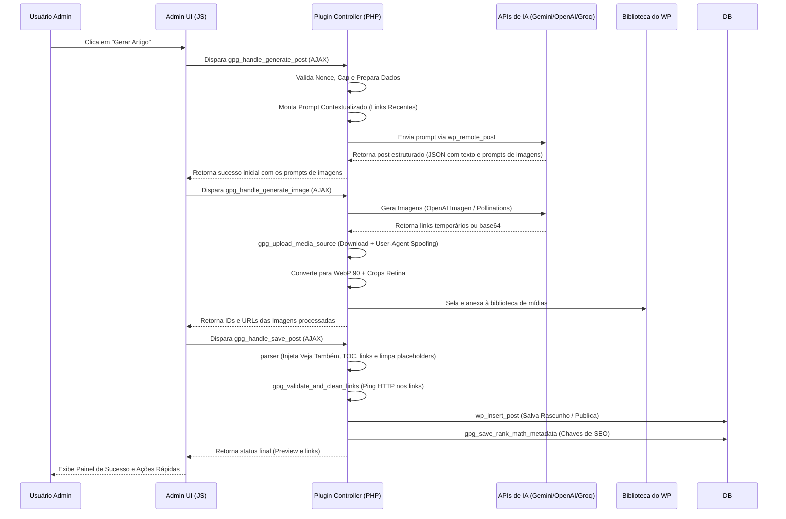
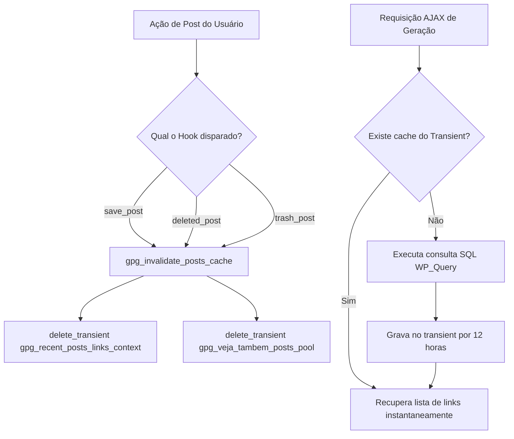
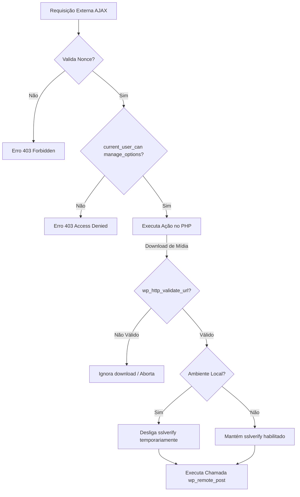

# Arquitetura do Sistema (Architecture Manual) — v1.0.0

Este documento apresenta o detalhamento técnico da arquitetura de software, fluxo de dados e integrações do plugin WordPress **Gerador de Posts (IA)**. Ele destina-se a engenheiros e arquitetos responsáveis pela manutenção e evolução estrutural da aplicação.

---

## 📖 Índice

1. [Organização e Estrutura de Arquivos](#-organização-e-estrutura-de-arquivos)
2. [Responsabilidade dos Componentes](#-responsabilidade-dos-componentes)
3. [Pipeline de Geração de Conteúdo](#-pipeline-de-geração-de-conteúdo)
4. [Integração de APIs de Inteligência Artificial](#-integração-de-apis-de-inteligência-artificial)
5. [Processamento de Mídias e Imagens](#-processamento-de-mídias-e-imagens)
6. [Otimização SEO e Integração com Rank Math](#-otimização-seo-e-integração-com-rank-math)
7. [Estratégia de Cache por Transients](#-estratégia-de-cache-por-transients)
8. [Fluxo e Mecanismos de Segurança](#-fluxo-e-mecanismos-de-segurança)
9. [Diagramas de Arquitetura (Mermaid)](#-diagramas-de-arquitetura-mermaid)

---

## 📁 Organização e Estrutura de Arquivos

O plugin adota uma estrutura limpa e em conformidade com as diretrizes do WordPress Codex:

```plaintext
gerador-posts-gemini/
├── assets/
│   ├── css/
│   │   ├── admin.css          # Estilos Outfit e interface do painel administrativo
│   │   └── frontend.css       # Estilos específicos do bloco "Veja Também" e TOC
│   └── js/
│       └── admin.js           # Lógica de controle do painel, AJAX e Puter.js
├── admin-ui.php               # Estrutura HTML/Visual do painel administrativo
├── gerador-posts-gemini.php   # Controlador principal e motor de regras de negócio
├── README.md                  # Documentação para usuários (PT-BR)
├── README_EN.md               # Documentação para usuários (EN)
├── CHANGELOG.md               # Histórico estruturado de alterações
└── LICENSE                    # Termo de Licença proprietária
```

---

## ⚙️ Responsabilidade dos Componentes

### 1. Controlador Principal (`gerador-posts-gemini.php`)
Atua como o núcleo operacional (Controller). Suas responsabilidades incluem:
*   Registrar hooks de inicialização, ativação e enfileiramento de assets do WordPress.
*   Prover endpoints de recepção de requisições AJAX do frontend administrativo.
*   Orquestrar a preparação do prompt, chamada das APIs externas e higienização estrutural de posts.
*   Fazer o processamento físico de downloads de mídias, conversão WebP, crops em tamanhos pré-definidos e inserção na biblioteca do WordPress.
*   Administrar o ciclo de vida do cache por Transients e interagir com metadados do plugin Rank Math SEO.

### 2. View Administrativa (`admin-ui.php`)
Contém o layout HTML renderizado no painel de controle do plugin. Suas responsabilidades incluem:
*   Estruturar visualmente o formulário de geração padrão (abas "Configurações", "Novo Post", "Agendador em Lote").
*   Mapear os seletores condicionais de provedores de IA.
*   Exibir os contêineres de progresso e painéis de sucesso do post com ações de edição rápidas.

### 3. Comportamento JavaScript (`assets/js/admin.js`)
Lida com a interatividade assíncrona do painel:
*   Gerenciar o envio assíncrono dos formulários AJAX de geração e salvamento.
*   Controlar a exibição em tempo real do pipeline visual de progresso de geração em lote.
*   Chamar a API local do Puter.js no navegador para geração de imagens grátis (Flux) via base64.
*   Realizar a sanitização dinâmica do slug e verificar em tempo real se a palavra-chave de foco está inserida na URL amigável.

---

## 🔄 Pipeline de Geração de Conteúdo

O fluxo de geração de conteúdo é mediado por AJAX e executa uma sequência ordenada de ações entre o frontend e o backend:

1.  **Interpretação e Captura:** O frontend captura a palavra-chave, tom de voz, tema e links contextuais.
2.  **Preparação de Dados:** O backend (`gpg_prepare_generation_data()`) valida e limpa as entradas recebidas.
3.  **Construção do Prompt:** A função `gpg_build_generation_prompt()` gera as instruções estruturais personalizadas.
4.  **Chamada de IA de Texto:** O backend faz a chamada de rede (`wp_remote_post`) para a API selecionada (OpenAI, Gemini ou Groq).
5.  **Escrita do Conteúdo:** A IA retorna o artigo estruturado contendo placeholders (`[IMAGE_1_PLACEHOLDER]`, etc.).
6.  **Geração e Download de Imagens:** Imagens são geradas localmente ou externamente, processadas em lote no backend e feito o sideload na biblioteca.
7.  **Higienização e SEO Final:** Executa filtros de links (validação 404), inclusão automática do Sumário de Conteúdo (TOC), do Bloco "Veja Também" e inserção das imagens na posição dos placeholders.
8.  **Gravação no WordPress:** Grava o post de fato e persiste metadados no Rank Math.

---

## 🔌 Integração de APIs de Inteligência Artificial

O plugin integra-se a múltiplos provedores por meio de wrappers HTTP no backend:

### Provedores de Texto (PHP)
*   **Google Gemini:** Modelos `gemini-3.5-flash`, `gemini-3.1-pro` e `gemini-3.1-flash-lite`. Utiliza a API oficial do Gemini com regras de retorno JSON restritas via parâmetros `responseSchema`.
*   **OpenAI:** Modelos `gpt-4o`, `gpt-4o-mini` e `o1-mini`. Utiliza a API REST da OpenAI especificando `response_format` como `json_object`.
*   **Groq:** Modelos `llama-3.3-70b-versatile`, `llama-3.1-8b-instant` e `gemma2-9b-it`. Realiza chamadas com tratamento de limite de tokens.

### Provedores de Imagem (PHP & JS)
*   **OpenAI:** Modelos `dall-e-3` (widescreen `1792x1024`) e `dall-e-2` (quadrado `1024x1024`).
*   **Google Imagen:** Modelo `imagen-4`.
*   **Flux (Pollinations.ai):** Modelos `flux` e `flux-anime`. A geração é disparada via requisição externa em PHP, exigindo chave de API Pollinations.
*   **Puter (Flux via Puter.js):** Executado diretamente no navegador do cliente em JavaScript, enviando a imagem gerada no formato Base64 para gravação no WordPress.

---

## 🖼️ Processamento de Mídias e Imagens

O plugin realiza processamento pesado de imagens para adequá-las às melhores práticas de performance web:

*   **Formatos e Compressão:** Qualquer imagem gerada é convertida automaticamente para o formato **WebP** com qualidade `90`, minimizando drasticamente o consumo de banda.
*   **Cortes Cirúrgicos (Retina Crops):**
    *   **Imagem de Destaque (Thumbnail):** Crop fixo de `1408x474` pixels.
    *   **Imagens Internas (Corpo 1 e Corpo 2):** Crop fixo de `1408x792` pixels (proporção widescreen 16:9).
*   **Spoofing de User-Agent:** Para evitar erros de download `403 Forbidden` disparados por CDNs de imagem protegidas pelo Cloudflare (que barram o User-Agent padrão do WordPress), o plugin utiliza o hook `http_request_args` no método `gpg_upload_media_source()` para simular um navegador Chrome legítimo durante o download temporário.

---

## 🔍 Otimização SEO e Integração com Rank Math

O motor de SEO do plugin garante indexabilidade máxima sem intervenção manual:

*   **Rank Math Integration:** Persiste a palavra-chave de foco e a meta descrição estruturada diretamente nas tabelas meta do Rank Math (`_rank_math_focus_keyword` e `_rank_math_description`).
*   **Controle de Títulos e Slugs:** O título é restrito a **65-70** caracteres (com reescrita inteligente por IA se estourar), e o slug é restrito a **75** caracteres contendo obrigatoriamente a palavra-chave.
*   **Inserção Adaptativa:** A palavra-chave de foco é inserida naturalmente na introdução, corpo e subtítulos, permitindo ligeiras flexões gramaticais sem forçar negritos desnecessários.
*   **Validação de Links contra Erro 404:** O método `gpg_validate_and_clean_links()` varre o post gerado antes de salvá-lo, executando uma requisição HTTP rápida (HEAD) para cada link externo ou interno. Se retornar `404 Not Found`, a tag `<a>` é convertida em texto simples de forma a evitar links quebrados e penalidades do Google.
*   **Menções de Marca:** O termo "TD Vieira Design" é detectado no texto e formatado dinamicamente como link destacado (`<strong><a href="https://tdvieiradesign.com">...`) sem interferir nas contagens de links do artigo.

---

## 💾 Estratégia de Cache por Transients

Para evitar consultas repetitivas de banco de dados e lentidão no painel administrativo, o plugin implementa um sistema de cache em memória/banco de dados baseado na API de Transients do WordPress com validade de **12 horas**:

### Estrutura de Transients

1.  `gpg_recent_posts_links_context`: Armazena a lista estruturada de URLs recentes do blog para ser inserida como contexto de linkagem interna no prompt textual da IA.
2.  `gpg_veja_tambem_posts_pool`: Armazena a lista de posts disponíveis para a renderização aleatória do bloco visual "Veja Também".

### Ciclo de Invalidação

O cache é invalidado e limpo instantaneamente toda vez que houver qualquer alteração na base de posts ativos por meio da função `gpg_invalidate_posts_cache()`, atrelada aos seguintes hooks nativos do WordPress:
*   `save_post` (Novo post criado ou post atualizado).
*   `deleted_post` (Post deletado permanentemente).
*   `trash_post` (Post enviado para a lixeira).

---

## 🔒 Fluxo e Mecanismos de Segurança

O plugin adota a arquitetura de segurança multicamadas do WordPress:

*   **Validação de Acesso (Capabilities):** Todas as chamadas de funções AJAX ou renderizações de painéis verificam explicitamente se o usuário logado possui a capacidade de gerenciar opções globais do WordPress via `current_user_can('manage_options')`.
*   **Verificação de Autenticidade (Nonces):** Requisições AJAX transmitem o cabeçalho `X-WP-Nonce` ou payload POST correspondente que é validado no backend através de `check_ajax_referer('gpg_generation_nonce_action')`.
*   **Prevenção contra SSRF:** URLs fornecidas para download de mídias são validadas de forma estrita usando `wp_http_validate_url()`, mitigando ataques de Server-Side Request Forgery de servidores internos.
*   **SSL Verify Dinâmico:** A validação SSL de requisições HTTP externas do plugin (`sslverify`) é mantida ativada por padrão. O plugin desliga a verificação de SSL apenas se detectar que o ambiente atual do LocalWP é explicitamente `'local'` ou `'development'` (evitando erros de certificados autoassinados em homologação local).

---

## 📊 Diagramas de Arquitetura (Mermaid)

### A. Fluxo Geral de Componentes e Dependências



### B. Pipeline Completo de Geração de Conteúdo



### C. Fluxo de Cache por Transients



### D. Fluxo de Segurança do Plugin


