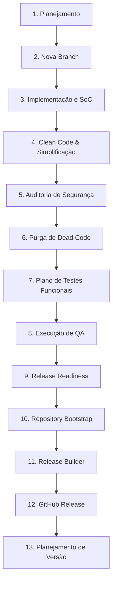

# Fluxo de Desenvolvimento (Development Workflow) — v1.0.0

Este documento descreve detalhadamente o processo, a filosofia e os critérios de qualidade adotados no ciclo de desenvolvimento do plugin **Gerador de Posts (IA)**. Ele serve como o guia oficial para que novos engenheiros compreendam desde a concepção de uma funcionalidade até a preparação de uma nova release.

---

## 📖 Índice

1. [Filosofia de Desenvolvimento](#-filosofia-de-desenvolvimento)
2. [Fluxo Completo de Desenvolvimento (End-to-End)](#-fluxo-completo-de-desenvolvimento-end-to-end)
3. [Critérios Obrigatórios de Aprovação (Definition of Done - DoD)](#-critérios-obrigatórios-de-aprovação-definition-of-done---dod)
4. [Padrões de Código e Diretrizes (WordPress)](#-padrões-de-código-e-diretrizes-wordpress)
5. [Controle de Qualidade e Política de QA](#-controle-de-qualidade-e-política-de-qa)
6. [Convenções de Versionamento (Semantic Versioning)](#-convenções-de-versionamento-semantic-versioning)
7. [Checklist de Encerramento de Releases](#-checklist-de-encerramento-de-releases)
8. [Manuais Operacionais Relacionados](#-manuais-operacionais-relacionados)

---

## 🧠 Filosofia de Desenvolvimento

Nossa filosofia de engenharia baseia-se em quatro pilares fundamentais:

*   **Separação de Preocupações (Separation of Concerns - SoC):** Código de visualização (HTML), estilização (CSS), comportamento do cliente (JS) e lógica de negócios (PHP) devem ser rigorosamente separados. Arquivos inline são terminantemente proibidos no ambiente de produção.
*   **Princípio de Responsabilidade Única (SRP):** Cada função, classe ou componente deve ter uma única responsabilidade clara. Funções "divinas" devem ser refatoradas em pequenos utilitários coesos e fáceis de testar.
*   **Segurança como Requisito Padrão (Security by Design):** Nenhuma funcionalidade é considerada concluída sem validação estrita de Nonces, Capabilities do WordPress, higienização de entrada (`sanitize_text_field`, `esc_url_raw`) e escape de saída (`esc_attr`, `esc_html`, `wp_kses_post`).
*   **Resiliência a Falhas Externas:** Integrações com APIs de inteligência artificial de terceiros (Google Gemini, OpenAI, Groq, Puter) devem ser isoladas e protegidas contra falhas de rede e timeouts de API, garantindo que o plugin nunca quebre o site do usuário final.

---

## 🔄 Fluxo Completo de Desenvolvimento (End-to-End)

O fluxo de trabalho técnico segue uma esteira rigorosa de fases sequenciais. Nenhuma etapa pode ser pulada.



### Detalhamento das Fases

#### 1. Planejamento (`/plan`)
Toda alteração estrutural ou nova funcionalidade deve começar com a execução do comando `/plan`. O agente `project-planner` cria um arquivo `{task-slug}.md` na raiz do repositório contendo o objetivo da tarefa, os passos incrementais e critérios específicos de verificação (Verification Criteria).

#### 2. Nova Branch (Git Workflow)
Toda tarefa deve ser desenvolvida in uma branch isolada a partir da branch principal.
*   **Formato de Branches:** `feature/[task-slug]` ou `fix/[bug-slug]`.
*   **Exemplo:** `feature/separacao-assets` ou `fix/ssrf-download-image`.

#### 3. Implementação e SoC
Desenvolvimento da lógica nos componentes adequados:
*   Scripts JS e estilos CSS criados estritamente na pasta `/assets`.
*   Localização dinâmica de variáveis via `wp_localize_script()` no PHP.
*   Garantia de que as funções se comunicam via endpoints AJAX bem delimitados.

#### 4. Clean Code & Simplificação
Revisão das funções criadas. O código deve ser limpo e autoexplicativo.
*   Evitar abstrações e comentários redundantes.
*   Funções PHP devem ter assinaturas claras com tipagem sempre que possível.
*   Utilizar funções nativas do WordPress (`wp_remote_post`, `download_url`, `wp_http_validate_url`) em vez de bibliotecas cURL puras.

#### 5. Auditoria de Segurança
O código é inspecionado contra vulnerabilidades conhecidas da OWASP:
*   Todas as requisições AJAX devem validar permissões usando `current_user_can()`.
*   Verificação do token de segurança do WordPress via `check_ajax_referer()`.
*   Validação estrita de URLs de origem contra SSRF (Server-Side Request Forgery).

#### 6. Purga de Dead Code (Código Morto)
Remoção sistemática de funções, classes ou variáveis declaradas e não utilizadas no sistema. Todos os blocos comentados de depuração temporária (`var_dump`, `console.log`) devem ser eliminados das branches de produção.

#### 7. Plano de Testes Funcionais
O agente `test-engineer` desenha um plano de testes funcionais detalhado (salvo como `functional_test_plan.md` na raiz pública de homologação). O plano detalha todos os casos de uso, entradas necessárias, etapas do teste e comportamento esperado do plugin.

#### 8. Execução de QA (Quality Assurance)
Execução dos cenários previstos no plano de testes. Todas as evidências de sucesso, erros simulados e logs devem ser registrados no documento `functional_test_report.md`. O bypass de autenticação em ambiente de testes locais pode ser mediado por scripts de autologin temporários (`autologin.php`), desde que nunca entrem no pacote final.

#### 9. Release Readiness (Prontidão de Release)
Uma auditoria final analisa o estado geral do software. O status do projeto é verificado contra a matriz de riscos técnicos. O processo avança apenas após a validação oficial do status de prontidão técnica como **GO (Pronto para Release)** no arquivo `release_readiness_report.md`.

#### 10. Repository Bootstrap
Garantia de que os metadados de governança do repositório estão corretos e atualizados:
*   `CHANGELOG.md` estruturado segundo os padrões de "Keep a Changelog".
*   Arquivo de `LICENSE` proprietária/comercial configurado.
*   Políticas de reporte de segurança em `SECURITY.md`.
*   Diretrizes de contribuição em `CONTRIBUTING.md`.
*   Configuração precisa dos delimitadores cross-platform em `.gitattributes` e `.gitignore`.

#### 11. Release Builder
Empacotamento automático e versionamento do plugin:
*   Geração do arquivo compactado de distribuição `gerador-posts-gemini.zip` na raiz pública.
*   O ZIP deve excluir arquivos exclusivos de desenvolvimento (como `.gitignore`, `.gitattributes`, scripts `.py`, documentações `/docs` e relatórios de QA `.md`).
*   Geração do Commit Semântico de release e criação da Tag Git correspondente à versão.

#### 12. GitHub Release
Envio dos metadados locais para o GitHub:
*   Execução do push do commit e da Tag Git para o repositório remoto.
*   Criação da release na interface do GitHub e upload do anexo ZIP compilado.

#### 13. Planejamento de Versão
Abertura de um novo ciclo de releases no repositório Git, arquivando a documentação e reiniciando o ciclo de planejamento de novas tarefas.

---

## 🚨 Critérios Obrigatórios de Aprovação (Definition of Done - DoD)

Uma alteração de código ou funcionalidade só será considerada **concluída (DONE)** se atender rigorosamente a todos os critérios a seguir:

| Critério | Descrição | Método de Verificação |
| :--- | :--- | :--- |
| **SoC Completo** | Nenhum bloco de código CSS ou JS inline no HTML ou PHP. | Inspeção visual e lint do código. |
| **Prefixação Estrita** | Todos os símbolos PHP, classes CSS e IDs de elementos JS começam com `gpg_`. | Busca global por símbolos sem prefixo. |
| **Segurança AJAX** | Todo endpoint AJAX valida o Nonce com `check_ajax_referer` e capacidade com `current_user_can`. | Auditoria de segurança do código-fonte. |
| **Proteção SSRF** | Downloads de mídias de IAs validam a URL de origem via `wp_http_validate_url`. | Verificação no método `gpg_upload_media_source`. |
| **Livre de Bugs de Console** | Nenhuma exceção JS não tratada no painel administrativo durante o fluxo de geração. | Monitoramento do Console de Ferramentas do Desenvolvedor. |
| **Homologação Funcional** | 100% dos testes planejados executados com sucesso (status PASS). | Relatório de QA sem falhas abertas. |
| **Resiliência a Timeouts** | Detecção de erros de rede HTTP e exibição de alertas de retry amigáveis ao usuário. | Simulação de falha de conexão (Timeout / HTTP 503). |

---

## 🛠️ Padrões de Código e Diretrizes (WordPress)

Adotamos as diretrizes recomendadas pelo **WordPress Coding Standards (WPCS)** com foco em legibilidade e performance:

1.  **Prefixação Global:**
    *   Funções PHP: `gpg_minha_funcao()`.
    *   Opções cadastradas em `wpgj_options`: `gpg_config_opcoes`.
    *   Classes CSS: `.gpg-btn`, `.gpg-pipeline-step`.
    *   IDs JavaScript: `#gpg-generation-form`.
2.  **Organização dos Assets:**
    *   Os arquivos CSS e JS não funcionais ao WordPress global não devem ser enfileirados em todas as telas da administração. A função `gpg_enqueue_admin_styles( $hook )` deve validar se a tela atual corresponde à página do plugin antes de executar o enqueue:
        ```php
        if ( 'toplevel_page_gerador-posts-gemini' !== $hook ) {
            return;
        }
        ```
3.  **Higienização e Escape:**
    *   Dados recebidos de formulários PHP/AJAX devem ser higienizados usando `sanitize_text_field()` ou `sanitize_textarea_field()`.
    *   Exibições HTML de strings de configurações devem usar `esc_attr()` em atributos ou `esc_html()` em blocos de texto.
    *   O editor de visualização do post utiliza `wp_kses_post()` para renderizar com segurança o HTML gerado pela IA.

---

## 🧪 Controle de Qualidade e Política de QA

Nossa política de QA garante que nenhuma versão chegue ao ambiente de produção com instabilidades:

*   **Ambiente de Homologação Local:** Os testes são executados localmente utilizando o ambiente estruturado LocalWP, rodando a versão estável do WordPress `7.0.2` (ou versão instalada do banco) sob o PHP `8.2.29` e banco de dados local MySQL `local`.
*   **Política de Bypass de Autenticação para Testes:** É autorizada a utilização temporária do arquivo `autologin.php` na raiz pública local do site para execução de chamadas AJAX seguras sem a necessidade de digitação repetitiva de logins em rotinas de homologação. Esse arquivo é excluído pelo `.gitignore` e pelo script de empacotamento, não integrando a release.
*   **Logs de Depuração Ativos:** Durante a homologação, a diretiva `WP_DEBUG_LOG` deve estar configurada como `true` no arquivo [wp-config.php](../../../../wp-config.php) para rastrear quaisquer `Notices`, `Warnings` ou `Errors` emitidos pela runtime do PHP.

---

## 🏷️ Convenções de Versionamento (Semantic Versioning)

O plugin utiliza estritamente o sistema **Semantic Versioning (SemVer) 2.0.0**:

*   **Formato:** `MAJOR.MINOR.PATCH` (Ex: `v1.0.0`)
    *   `MAJOR`: Alterações incompatíveis na API interna do plugin ou grandes remodelações de arquitetura.
    *   `MINOR`: Adição de novas funcionalidades (como novos provedores de imagem ou texto) mantendo compatibilidade total.
    *   `PATCH`: Correções de bugs de segurança, ajustes finos de CSS, ou tratamentos de resiliência.
*   **Git Tags:** Toda release oficial deve ter sua tag criada no Git precedida pela letra "v" (Ex: `v1.0.0`).
*   **Mensagens de Commit Semânticas:** Seguimos a especificação do Conventional Commits para commits de release:
    *   `release(v1.0.0): primeira versão oficial do Gerador de Posts (IA)`

---

## 📋 Checklist de Encerramento de Releases

Antes de finalizar qualquer release e disparar o processo de empacotamento de uma nova versão, execute o script centralizado de validação na raiz do projeto:

```bash
# Executa a validação completa de QA e conformidade
python .agents/scripts/checklist.py .
```

O script realizará a validação dos seguintes aspectos:
1.  **Vulnerabilidades de Segurança:** Inspeciona vulnerabilidades críticas.
2.  **Lint e Validação:** Varre erros sintáticos no PHP e Javascript.
3.  **Esquemas de Banco de Dados:** Valida correspondências.
4.  **UX e Acessibilidade:** Executa análises básicas.
5.  **SEO e Otimização:** Garante que metadados Rank Math estão funcionando.

Se o validador retornar qualquer falha crítica, a release **não poderá ser fechada** até que a respectiva branch de correção seja mergeada e aprovada pelo pipeline.

---

## 🔗 Manuais Operacionais Relacionados

Para guias adicionais de inicialização, diagnósticos de erros e manutenção para evoluções futuras, consulte:
*   **[BOOTSTRAP_LOCALWP.md](BOOTSTRAP_LOCALWP.md):** Roteiro de setup e preparação do ambiente local do zero.
*   **[TROUBLESHOOTING.md](TROUBLESHOOTING.md):** Base de conhecimento para detecção e correção de falhas e timeouts.
*   **[MAINTENANCE_GUIDE.md](MAINTENANCE_GUIDE.md):** Guia prático de evolução técnica e rotinas de manutenção.

