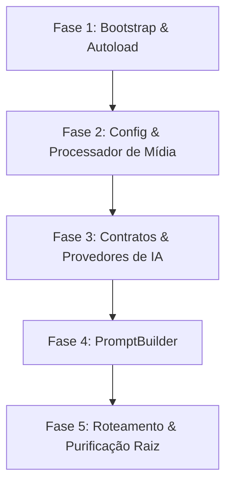

# Plano de Implementação da Arquitetura de IA — v2.0.0

Este plano estabelece as fases, dependências e estratégias de validação para implementar a nova arquitetura orientada a objetos (v2.0.0) na camada de Inteligência Artificial do plugin **Gerador de Posts (IA)**. O objetivo é migrar o core monolítico do plugin para um padrão de código limpo de forma incremental, garantindo a compatibilidade de rede e a testabilidade de regressão a cada etapa.

---

## 🏛️ 1. Diretrizes de Migração Incremental (Segurança e Regressão)

*   **Preservação de Compatibilidade:** Durante toda a migração, o plugin original em [gerador-posts-gemini.php](gerador-posts-gemini.php) deve continuar operando sem alterações de comportamento para o usuário final. As novas classes serão introduzidas em paralelo e ativadas em blocos atômicos.
*   **Controle de Versão (Git):** Cada fase de implementação descrita abaixo deve ser desenvolvida em uma ramificação (branch) de funcionalidade isolada (`feature/refactor-ia-faseX`) e homologada em testes locais antes da mesclagem (merge) na ramificação de desenvolvimento.
*   **Tratamento de Chaves de Banco:** Fica terminantemente proibido reconfigurar ou apagar chaves de opções salvas no banco de dados do WordPress (`gpg_gemini_api_key`, etc.). O módulo de configuração lerá as chaves antigas de forma transparente para evitar quebras de retrocompatibilidade.

---

## 📅 2. Fases de Implementação e Dependências

### 🔹 Fase 1: Infraestrutura de Autoload e Ciclo de Vida
*   **Descrição:** Configurar o carregamento automático de classes (Autoloader PSR-4) e o gerenciador do ciclo de vida do plugin.
*   **Dependências:** Nenhuma.
*   **Arquivos Criados/Modificados:**
    *   `gerador-posts-gemini.php` (Modificado para registrar o autoloader básico).
    *   `includes/PluginBootstrap.php` (Criado como singleton de controle).
*   **Pontos de Validação:**
    *   Instanciar uma classe dummy de teste em `includes/` no bootstrap para certificar que o carregador automático mapeia corretamente a pasta física.
*   **Critérios de Aprovação:** O plugin carrega sem gerar avisos (warnings) ou exceções PHP na ativação ou carregamento do painel do WordPress.
*   **Estratégia de Rollback:** Remover o registro do `spl_autoload_register` do arquivo de bootstrap raiz e restaurar o controlador procedural monolítico.

### 🔹 Fase 2: Configuração Centralizada e Serviços de Mídia
*   **Descrição:** Centralizar as chaves de API, constantes de modelos e desacoplar o processamento físico de imagens (WebP, retina crops, downloads contra SSRF).
*   **Dependências:** Fase 1 concluída.
*   **Arquivos Criados/Modificados:**
    *   `includes/Core/Config.php` (Criado para gerenciar opções WP).
    *   `includes/Services/MediaProcessor.php` (Criado para assumir downloads e cortes).
    *   `gerador-posts-gemini.php` (Modificado para ler chaves via classe `Config` e delegar download de mídias para `MediaProcessor`).
*   **Pontos de Validação:**
    *   Executar a geração manual de imagens por IA e conferir se o download, conversão para WebP 90 e crops de Retina (`1408x474` e `1408x792`) são aplicados corretamente.
*   **Critérios de Aprovação:** Processamento de mídia funcionando sem quebra de links de imagens e persistência de dados intacta na biblioteca do WordPress.
*   **Estratégia de Rollback:** Reverter as chamadas às funções procedurais antigas de mídias via Git, descartando as classes criadas em `Core/` e `Services/`.

### 🔹 Fase 3: Abstração e Provedores de Texto e Imagem
*   **Descrição:** Implementar os contratos e provedores dedicados de IA (Gemini, OpenAI, Groq, Imagen, Dall-E) isolando as conexões HTTP e formatação de esquemas de JSON de retorno.
*   **Dependências:** Fase 2 concluída.
*   **Arquivos Criados/Modificados:**
    *   `includes/AI/Contracts/TextProviderInterface.php` (Criado)
    *   `includes/AI/Contracts/ImageProviderInterface.php` (Criado)
    *   `includes/AI/Providers/AbstractProvider.php` (Criado - classes comuns HTTP/timeout)
    *   `includes/AI/Providers/GeminiProvider.php` (Criado)
    *   `includes/AI/Providers/OpenAIProvider.php` (Criado)
    *   `includes/AI/Providers/GroqProvider.php` (Criado)
    *   `includes/AI/Providers/DallEProvider.php` (Criado)
    *   `includes/AI/Providers/GoogleImagenProvider.php` (Criado)
    *   `includes/AI/ProviderFactory.php` (Criado)
*   **Pontos de Validação:**
    *   Criar rotas de teste temporárias no PHP para disparar chamadas de texto e imagem via novas classes, validando se o retorno JSON de texto é parseado de forma idêntica à do modelo original.
*   **Critérios de Aprovação:** Respostas íntegras das IAs, tratamento de timeout operando em 90 segundos com lançamento de exceções controladas em caso de indisponibilidade de rede.
*   **Estratégia de Rollback:** Desativar a fábrica de provedores, mantendo as antigas funções `gpg_call_*` ativas no arquivo monolítico.

### 🔹 Fase 4: PromptBuilder Dinâmico
*   **Descrição:** Extrair a construção estática de prompts do post e imagens para uma classe dinâmica, permitindo variação de contexto e testes de regressão de strings de forma isolada.
*   **Dependências:** Fase 3 concluída.
*   **Arquivos Criados/Modificados:**
    *   `includes/AI/PromptBuilder.php` (Criado)
    *   `gerador-posts-gemini.php` (Modificado para invocar a classe para compor o prompt enviado à API).
*   **Pontos de Validação:**
    *   Capturar a string gerada pela nova classe `PromptBuilder` e comparar por diff textual com a string gerada pela antiga função procedural. As strings devem ser equivalentes nas diretrizes de SEO e sumários.
*   **Critérios de Aprovação:** prompt gerado compatível em pt-BR e integrando perfeitamente a palavra-chave de foco fornecida.
*   **Estratégia de Rollback:** Retornar a chamada do prompt no controlador principal para a antiga função de strings `gpg_build_generation_prompt`.

### 🔹 Fase 5: Roteamento AJAX, Desativação e Homologação Final
*   **Descrição:** Redirecionar todos os ganchos (hooks) AJAX do WordPress para as classes controladoras em `PluginBootstrap` e limpar completamente as 1500 linhas procedurais do arquivo raiz.
*   **Dependências:** Fase 4 concluída.
*   **Arquivos Criados/Modificados:**
    *   `gerador-posts-gemini.php` (Modificado para atuar estritamente como ponto de entrada e autoloader - tamanho reduzido para menos de 35 linhas).
    *   `includes/PluginBootstrap.php` (Modificado para registrar os callbacks AJAX para seus próprios métodos controladores).
*   **Pontos de Validação:**
    *   Executar o ciclo completo de geração de posts por IA do painel (geração de texto, geração de imagem, sideload de mídias e persistência de SEO no Rank Math).
    *   Realizar testes de segurança (chamadas AJAX sem nonce e capabilities administrativas) e validar se são rejeitados com erro 403 Forbidden.
*   **Critérios de Aprovação:** Geração de posts ponta a ponta em perfeito funcionamento e remoção total do código acoplado procedural do arquivo de entrada.
*   **Estratégia de Rollback:** Executar o checkout no Git do arquivo principal `gerador-posts-gemini.php` para seu estado original estável (anterior à Fase 1), restaurando imediatamente a operação procedural legada.

---

## 🎯 3. Critérios Gerais de Homologação (Definição de Concluído)

A migração arquitetural será considerada totalmente concluída e homologada para distribuição de produção quando preencher os seguintes critérios:

1.  **Zero Código Procedural de IA na Raiz:** O arquivo de entrada limita-se unicamente ao registro do Autoloader PSR-4 e inicialização do `PluginBootstrap`.
2.  **Isolamento de Erros e Exceções:** Falhas de rede de IAs de terceiros são tratadas no nível dos provedores correspondentes, lançando erros formatados e amigáveis para a tela administrativa do WordPress.
3.  **Proteções WordPress Mantidas:** Todos os novos callbacks AJAX executam de forma obrigatória as verificações de Capabilities e Nonces, conforme regras estipuladas no [engineering.md](../.agents/rules/engineering.md).
4.  **Preservação das Tabelas Meta:** O salvamento de posts mantém intacto o mapeamento de campos meta do Rank Math e invalidação de cache via Transients.

---

## 🚦 Bloco de Status do Relatório
*   **Status:** Concluído
*   **Fase:** Planejamento da Camada de Inteligência Artificial
*   **Resultado:** Aprovado (Plano de Implementação Consolidado)
*   **Validação:** Revisão Arquitetural de OOP e Retrocompatibilidade
