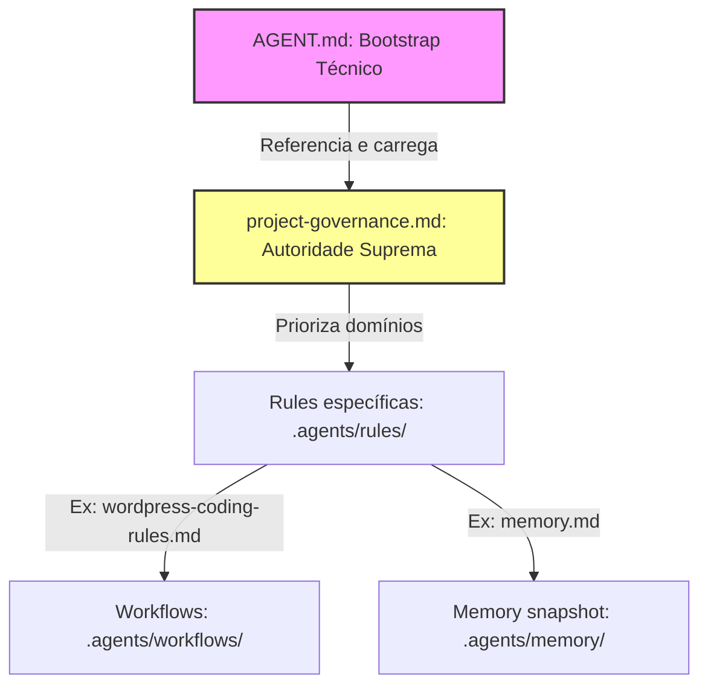

# Plano Oficial de Migração da Governança (Antigravity System) — v1.0.0

Este documento descreve o plano oficial e o cronograma passo a passo de migração da governança assistida do plugin **Gerador de Posts (IA)**. O objetivo é implementar a arquitetura alvo de governança purificada, eliminando redundâncias de autoridade e blindando o princípio de **Single Source of Truth (SSoT)** sem interromper a estabilidade operacional dos turnos de desenvolvimento.

> [!IMPORTANT]
> Em conformidade com as diretrizes do usuário, **nenhum arquivo do projeto foi alterado ou modificado**. Este documento é estritamente um plano técnico preliminar de planejamento.

---

## 🏛️ 1. Arquitetura Alvo da Governança

A arquitetura final do ecossistema de governança assistida do Antigravity é organizada sob a seguinte árvore hierárquica e dependências estritas:

*   **Ponto Inicial:** [AGENT.md](../../AGENT.md) atua exclusivamente como **Bootstrap Técnico** de onboarding de sessão (carrega o mapa físico e indica a ordem de leitura do contexto).
*   **Autoridade Soberana:** [project-governance.md](file:///C:/Users/tdvie/Local%20Sites/blog/app/public/wp-content/plugins/gerador-posts-gemini/.agents/rules/project-governance.md) é o **Único Ponto de Verdade (SSoT)** para hierarquias de prioridade e princípios supremos.
*   **Regras de Codificação:** Criado o arquivo [wordpress-coding-rules.md](file:///C:/Users/tdvie/Local%20Sites/blog/app/public/wp-content/plugins/gerador-posts-gemini/.agents/rules/wordpress-coding-rules.md) sob o diretório de regras permanentes para isolar normas técnicas específicas de desenvolvimento.
*   **Procedimentos (Workflows):** Purificados de regras técnicas e todos amarrando o início de sua lógica ao bootstrap raiz.

---

## 📅 2. Cronograma de Migração Incremental (Fases)

Para assegurar que o SSoT não seja corrompido durante a transição, a migração será dividida em 5 fases sequenciais obrigatórias:

### 🔹 Fase 1: Isolamento de Regras Técnicas de WordPress
*   **Objetivo:** Extrair as regras permanentes de código do workflow de desenvolvimento e centralizá-las no diretório correto.
*   **Ações:**
    1.  Criar o arquivo [wordpress-coding-rules.md](file:///C:/Users/tdvie/Local%20Sites/blog/app/public/wp-content/plugins/gerador-posts-gemini/.agents/rules/wordpress-coding-rules.md) (regras de Capabilities, Nonces, AJAX e Assets).
    2.  Editar o workflow [plugin-development.md](file:///C:/Users/tdvie/Local%20Sites/blog/app/public/wp-content/plugins/gerador-posts-gemini/.agents/workflows/plugin-development.md) removendo as seções de codificação (linhas 13-16) e adicionando um link de referência apontando para a nova regra de domínio.
*   **Preservação do SSoT:** O conhecimento de código do plugin é movido antes que o bootstrap mude, garantindo que o agente executor tenha acesso contínuo às diretrizes técnicas de segurança.

### 🔹 Fase 2: Unificação da Autoridade Soberana
*   **Objetivo:** Eliminar conflitos de prioridades normativas e de boot inicial.
*   **Ações:**
    1.  Editar o arquivo [project-governance.md](file:///C:/Users/tdvie/Local%20Sites/blog/app/public/wp-content/plugins/gerador-posts-gemini/.agents/rules/project-governance.md): catalogar a nova regra de codificação e ratificar a primazia absoluta da constituição sobre o bootstrap do agente.
    2.  Editar o arquivo [memory.md](file:///C:/Users/tdvie/Local%20Sites/blog/app/public/wp-content/plugins/gerador-posts-gemini/.agents/rules/memory.md): alterar a diretriz de "Ponto de Entrada" (linha 9) para "Etapa 3 de Carregamento de Contexto", explicitando a subordinação ao `AGENT.md`.
    3.  Editar o arquivo [MEMORY.md](file:///C:/Users/tdvie/Local%20Sites/blog/app/public/wp-content/plugins/gerador-posts-gemini/.agents/memory/MEMORY.md): remover o roteiro duplicado de leitura recomendado (linhas 7-15).
*   **Preservação do SSoT:** Garante que a constituição absorva todos os domínios normativos antes de limpar o bootstrap de entrada.

### 🔹 Fase 3: Purificação do Bootstrap Raiz (`AGENT.md`)
*   **Objetivo:** Purificar o onboarding técnico na raiz do projeto.
*   **Ações:**
    1.  Editar [AGENT.md](../../AGENT.md): remover a tabela de Hierarchy of Authority (linhas 27-35), substituindo-a por um link direto para a seção de hierarquia em `project-governance.md`.
    2.  Alterar referências do termo "soberano" para "inicializador de onboarding técnico".
*   **Preservação do SSoT:** O bootstrap raiz perde a responsabilidade de ditar a hierarquia de regras, delegando-a formalmente e exclusivamente para a Constituição Geral.

### 🔹 Fase 4: Padronização do Onboarding nos Workflows
*   **Objetivo:** Blindar o "Single Entry Point" em todos os cenários operacionais de turnos.
*   **Ações:**
    1.  Editar individualmente os outros 9 workflows de [.agents/workflows/](file:///C:/Users/tdvie/Local%20Sites/blog/app/public/wp-content/plugins/gerador-posts-gemini/.agents/workflows) (incluindo `audit-execution.md`, `qa-validation.md`, `memory-update.md`, etc.).
    2.  Adicionar no início de cada um a seção de carregamento obrigatória:
        > "### 1. Carregamento de Onboarding
        > * O agente de IA inicia a tarefa consultando o bootstrap `AGENT.md` na raiz do plugin.
        > * Ler as regras de domínio sob `.agents/rules/`."

### 🔹 Fase 5: Auditoria e Homologação
*   **Objetivo:** Validar a consistência estrutural das alterações e atestar o encerramento da migração.
*   **Ações:**
    1.  Executar uma auditoria completa de links relativos markdown em toda a árvore `.agents/`.
    2.  Atualizar o consolidado de status em [project-status.md](file:///C:/Users/tdvie/Local%20Sites/blog/app/public/wp-content/plugins/gerador-posts-gemini/.agents/memory/project-status.md) registrando a conclusão da migração da governança.

---

## 📈 3. Análise de Riscos e Mitigação

| Identificação do Risco | Nível de Impacto | Probabilidade | Estratégia de Mitigação |
| :--- | :--- | :--- | :--- |
| **Bypass de Regras Normativas:** O agente de IA ignora as novas regras e opera em contexto isolado por workflows não atualizados. | Crítico | Média | Execução estrita do checklist de regressão física nas PRs e proibição de merges caso os workflows secundários não incluam a seção de onboarding para [AGENT.md](../../AGENT.md). |
| **Divergência Sintática de Links:** Quebra de links relativos devido ao remanejamento de regras e caminhos de arquivos. | Médio | Alta | Uso obrigatório de scripts locais ou checagem estática manual rigorosa de integridade de referências markdown ao término de cada fase do cronograma. |
| **Inconsistência de Contexto (Boot Interrompido):** O agente inicia no meio da Fase 2 ou 3 e lê dados inconsistentes de autoridade. | Alto | Baixa | Bloquear qualquer desenvolvimento de código de features do plugin durante as janelas de manutenção ativa da governança. A migração deve ser commitada de forma atômica e exclusiva. |

---

*Plano de Migração de Governança gerado, auditado e persistido com sucesso na raiz do repositório.*
