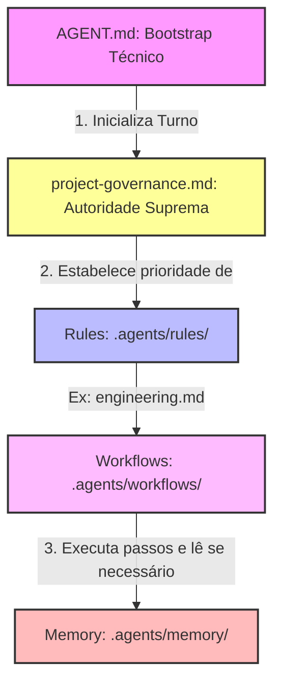

# Plano Oficial de Migração da Governança (Antigravity System) — v2.0.0 (Consolidado)

Este documento estabelece a versão revisada e consolidada do plano oficial de migração da governança assistida por IA do plugin **Gerador de Posts (IA)**. Este plano substitui as propostas anteriores e incorpora as decisões de design arquitetural homologadas para unificar a autoridade, centralizar regras de engenharia e otimizar o carregamento de memória por contexto.

---

## 🏛️ 1. Arquitetura Alvo da Governança

A arquitetura consolidada divide rigorosamente as responsabilidades do ecossistema `.agents/` para blindar o princípio de **Single Source of Truth (SSoT)** e a **Separação Conceitual (SRP de Conhecimento)**:



### Responsabilidades Exclusivas por Artefato

1.  **[AGENT.md](../../AGENT.md) (Bootstrap Técnico):** Atua unicamente como o inicializador de sessão técnico. Contém a localização física dos diretórios do framework, a ordem sequencial de carregamento do framework e o mapa taxonômico. É terminantemente proibido conter regras normativas de conduta, prioridades por extenso ou diretrizes de engenharia.
2.  **[project-governance.md](.agents/rules/project-governance.md) (Constituição Geral):** É o ponto central e soberano do projeto. Define os Princípios Permanentes de Desenvolvimento, os critérios para abertura do Socratic Gate e a Hierarchy of Authority unificada.
3.  **[engineering.md](.agents/rules/engineering.md) (Regras de Engenharia - NOVO):** Concentra **todas** as regras técnicas permanentes de desenvolvimento de código-fonte (padrões de segurança do WordPress, enfileiramento seletivo de CSS/JS, isolamento de assets, tratamento de Nonces e verificação de Capabilities em rotas AJAX). Substitui a proposta anterior de `wordpress-coding-rules.md` para abranger a totalidade do desenvolvimento técnico do projeto.
4.  **Rules de Domínio (`.agents/rules/*.md`):** Regras de infraestrutura e dados do ecossistema assistido (`git.md` para versionamento, `memory.md` para manipulação de snapshots, `documentation.md` para redação e links relativos).
5.  **Workflows (`.agents/workflows/*.md` - Procedimentos):** Atuam unicamente como roteiros operacionais de passos lógicos (SOPs) e checklists de validação de QA (DoD). Não ditam nem contêm regras técnicas de codificação em seu corpo, apenas referenciam o `engineering.md` e carregam a memória sob demanda.
6.  **Memória Persistente (`.agents/memory/` - Snapshots):** Registra exclusivamente o estado físico do repositório (tabelas de status, releases e ADRs). **Não faz parte do bootstrap obrigatório**.

---

## 🚦 2. Sequência Oficial de Carregamento do Framework (Boot Sequence)

Toda sessão assistida por IA deve seguir rigorosamente a sequência de carregamento do framework para garantir a herança de regras:

```
[Passo 1: Onboarding]
   AGENT.md (Bootstrap Técnico)
        │
        ▼
[Passo 2: Governança Geral]
   project-governance.md (Suprema Autoridade)
        │
        ▼
[Passo 3: Orquestração Operacional]
   Seleção do Workflow correspondente (.agents/workflows/)
        │
        ├─────────────────────────────┐
        ▼                             ▼
[Passo 4: Regras de Domínio]   [Passo 5: Carregamento de Memória]
   engineering.md / git.md        project-status.md / MEMORY.md
   (Invocadas pelo Workflow)      (Carregados condicionalmente sob demanda)
```

1.  **Boot Inicial:** O agente inicia no repositório lendo [AGENT.md](../../AGENT.md) para registrar a taxonomia física.
2.  **Carregamento da Constituição:** O agente lê [project-governance.md](.agents/rules/project-governance.md) para consolidar a hierarquia soberana de autoridade e os limites éticos/operacionais.
3.  **Identificação do Workflow:** O agente lê o workflow lógico adequado para a tarefa em [.agents/workflows/](.agents/workflows/).
4.  **Herança de Regras Técnicas:** O workflow instrui o agente a carregar a regra [engineering.md](.agents/rules/engineering.md) (se a tarefa envolver alteração de código) ou a regra de documentação correspondente.
5.  **Acesso de Memória Contextual:** O workflow orienta o agente se é necessário ler a pasta `memory/` (ex: tarefas de hotfixes isolados podem prescindir de memória histórica, enquanto auditorias de fases exigem a leitura de `project-status.md`).

---

## 📅 3. Estratégia de Migração Faseada (Plano de Ação)

A migração é programada em 4 fases atômicas de manutenção incremental da governança:

### Fase 1: Centralização de Engenharia (`engineering.md`)
*   **Arquivos Criados/Alterados:**
    *   Criar [.agents/rules/engineering.md](.agents/rules/engineering.md) centralizando diretrizes de Nonces, AJAX, Capabilities e organização de assets.
    *   Editar [plugin-development.md](.agents/workflows/plugin-development.md): remover as regras técnicas das linhas 13-16 e substituí-las por links markdown relativos de referência direta para a nova regra de engenharia.
*   **Preservação do SSoT:** O conhecimento de código do plugin é movido para o diretório de regras permanentes de domínio antes que o bootstrap mude.

### Fase 2: Ajuste da Constituição e Regras de Memória
*   **Arquivos Alterados:**
    *   Editar [project-governance.md](.agents/rules/project-governance.md): catalogar a regra `engineering.md` no Nível 2 e remover qualquer redundância.
    *   Editar [memory.md](.agents/rules/memory.md): alterar a regra de "Ponto de Entrada" (linha 9) para "Etapa 3 de Carregamento Contextual", explicitando a subordinação e removendo a obrigatoriedade de boot geral da memória.
    *   Editar [MEMORY.md](.agents/memory/MEMORY.md): remover a seção repetida de ordens de leitura recomendadas (linhas 7-15).
*   **Preservação do SSoT:** Purifica a autoridade suprema e garante que o carregamento de memória passe a ser tratado como opcional/sob demanda.

### Fase 3: Purificação do Bootstrap Raiz (`AGENT.md`)
*   **Arquivos Alterados:**
    *   Editar [AGENT.md](../../AGENT.md): remover a tabela de Hierarchy of Authority (linhas 27-35), substituindo-a por links relativos direcionados para a seção de hierarquia em `project-governance.md`.
    *   Eliminar referências de "soberania" do bootstrap, caracterizando-o estritamente como inicializador técnico.
    *   Remover a menção obrigatória à pasta de memória no onboarding inicial.
*   **Preservação do SSoT:** O bootstrap raiz perde a responsabilidade de ditar a hierarquia de regras, delegando-a formalmente e exclusivamente para a Constituição Geral.

### Fase 4: Alinhamento de Workflows e Introdução da Memória sob Demanda
*   **Arquivos Alterados:**
    *   Editar os outros 9 workflows em [.agents/workflows/](.agents/workflows/) (incluindo `audit-execution.md`, `qa-validation.md`, `memory-update.md`, etc.).
    *   Inserir no início de cada workflow o passo inicial padronizado de onboarding via [AGENT.md](../../AGENT.md).
    *   Adicionar, no passo seguinte de cada workflow, se a leitura da memória persistente (`project-status.md`, `blog-architecture.md`) é obrigatória ou opcional com base na finalidade do workflow.
*   **Preservação do SSoT:** Garante que a governança do Antigravity CLI e dos agentes execute o onboarding completo em todas as sessões.

---

## 🎯 4. Critérios de Aceitação da Migração (DoD para Homologação)

Para homologar a migração e validar a nova infraestrutura, os seguintes critérios devem ser cumpridos de forma estrita:

*   [ ] **Validação de Single Source of Truth (SSoT):** Nenhuma regra normativa geral de tomada de decisão ou *Hierarchy of Authority* está descrita fora de [project-governance.md](.agents/rules/project-governance.md).
*   [ ] **Bootstrap Único:** O arquivo [AGENT.md](../../AGENT.md) é o único documento apontado na raiz do repositório como inicializador técnico de sessões. Nenhum arquivo de regra, manual ou memória se autodeclara ponto de entrada.
*   [ ] **Ausência de Responsabilidades Duplicadas:** Todas as regras técnicas estão concentradas em `engineering.md` e regras de domínio; workflows descrevem exclusivamente passos processuais lógicos (SOPs); memória hospeda exclusivamente snapshots estáticos.
*   [ ] **Carregamento Obrigatório nos Workflows:** 100% dos workflows operacionais em `.agents/workflows/` iniciam com o passo formal de carregamento do `AGENT.md`.
*   [ ] **Carregamento Contextual de Memória:** O `AGENT.md` e as regras permanentes não impõem a leitura obrigatória da pasta de memória no boot geral da sessão. A leitura de `project-status.md` ou `MEMORY.md` reside como uma diretiva de carregamento específica e opcional no início dos workflows.
*   [ ] **Integridade de Links Internos:** Todos os links markdown nos arquivos de governança são relativos, funcionais e livres de caminhos locais absolutos do Windows ou barras invertidas.
*   [ ] **Compatibilidade dos Workflows Existentes:** Os workflows mantêm as suas finalidades originais de engenharia, checklists de conformidade e testes funcionais originais de QA intactos.
*   [ ] **Eliminação de Regras em Prompts:** Nenhuma instrução temporária de prompts ou sidecars de sessão deve descrever regras permanentes por extenso, herdando-as automaticamente ao indicar a consulta a [project-governance.md](.agents/rules/project-governance.md) e [engineering.md](.agents/rules/engineering.md).

---

*Plano de Migração Consolidado v2 gerado e gravado com sucesso na raiz do projeto.*

---

## 🚦 Bloco de Status do Relatório
*   **Status:** Concluído
*   **Fase:** Planejamento de Migração da Governança
*   **Resultado:** Aprovado (Plano Consolidado v2 Homologado)
*   **Validação:** Revisão Arquitetural de Registros de Decisões (ADR)

