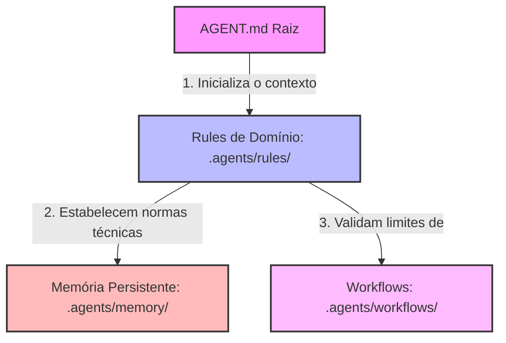

# Relatório de Auditoria de Responsabilidades da Governança (Antigravity System) — v1.0.0

Este relatório apresenta a auditoria de responsabilidades da governança do repositório do plugin **Gerador de Posts (IA)**. O objetivo é mapear a finalidade de cada artefato da infraestrutura `.agents/`, identificar sobreposições conceituais, conflitos de autoridade e propor uma distribuição clara que blindará o princípio de **Single Source of Truth (SSoT)** e a **Separação Conceitual (SRP de Conhecimento)**.

---

## 🏛️ 1. Matriz de Responsabilidade Proposta (SRP de Conhecimento)

Para garantir o isolamento estrito de domínios, cada arquivo na infraestrutura de governança deve atender a uma responsabilidade exclusiva:



*   **[AGENT.md](../../AGENT.md) (Bootstrap Técnico):** Responsável exclusivo por inicializar a sessão do agente de IA. Deve apenas descrever a taxonomia do diretório `.agents/` e definir a ordem sequencial de carregamento do contexto do repositório.
*   **[project-governance.md](file:///C:/Users/tdvie/Local%20Sites/blog/app/public/wp-content/plugins/gerador-posts-gemini/.agents/rules/project-governance.md) (A Constituição - Norma Suprema):** Responsável por ditar os Princípios Permanentes de Desenvolvimento, definir a hierarquia de autoridade soberana e estipular os critérios gerais para abertura de Socratic Gate.
*   **Rules de Domínio (`.agents/rules/*.md` - Código Normativo Específico):** Responsáveis exclusivos por normatizar os limites e padrões técnicos de áreas restritas do ecossistema (`git.md` para versionamento, `memory.md` para gravação de snapshots, `documentation.md` para arquivos markdown e `workflows.md` para o isolamento de automações).
*   **Workflows (`.agents/workflows/*.md` - Procedimentos Operacionais):** Responsáveis exclusivos por guiar o passo a passo lógico e fornecer checklists operacionais de execução (DoD) de rotinas e tarefas. **Não criam nem contêm regras técnicas ou normativas**.
*   **Memória Persistente (`.agents/memory/*.md` - Registro Histórico Dinâmico):** Responsável exclusivamente por registrar o snapshot de status do repositório, releases e diários de ADRs. Não dita comportamento de turnos nem lógicas de validação.

---

## ⚠️ 2. Diagnóstico de Sobreposições e Violações de SSoT

Durante a auditoria, foram catalogados os seguintes problemas e desvios conceituais de Separation of Concerns (SoC) na governança:

### A. Duplicação da Hierarchy of Authority (Violação de SSoT)
*   **Ocorrência:** A ordem estrita de precedência está descrita tanto no [AGENT.md (linhas 27-35)](../../AGENT.md#L27-L35) quanto no [project-governance.md (linhas 30-39)](file:///C:/Users/tdvie/Local%20Sites/blog/app/public/wp-content/plugins/gerador-posts-gemini/.agents/rules/project-governance.md#L30-L39).
*   **Impacto:** Se um novo nível de documentação for inserido ou a hierarquia mudar, o ecossistema entrará em colapso sintático caso os dois arquivos fiquem dessincronizados. A verdade normativa sobre a autoridade deve residir em um único ponto.

### B. Definição Conflitante do Ponto de Entrada (Conflito de Autoridade)
*   **Ocorrência:** O arquivo [memory.md (linha 9)](file:///C:/Users/tdvie/Local%20Sites/blog/app/public/wp-content/plugins/gerador-posts-gemini/.agents/rules/memory.md#L9) estipula que a leitura de `project-status.md` é a primeira ação obrigatória ("Ponto de Entrada") de toda sessão de desenvolvimento. Por outro lado, o [AGENT.md (linhas 3-5)](../../AGENT.md#L3-L5) afirma que ele próprio é o ponto de entrada oficial soberano e obrigatório de onboarding de carregamento de sessão.
*   **Impacto:** O agente recebe comandos normativos concorrentes no boot, o que pode levá-lo a saltar etapas cruciais de entendimento de regras globais e versionamento Git se iniciar direto pela leitura da memória.

### C. Mistura de Regras de Codificação WordPress em Workflows Operacionais (Desvio de SRP)
*   **Ocorrência:** O arquivo [plugin-development.md (linhas 13-16)](file:///C:/Users/tdvie/Local%20Sites/blog/app/public/wp-content/plugins/gerador-posts-gemini/.agents/workflows/plugin-development.md#L13-L16) define padrões de codificação PHP e WordPress em sua estrutura (regras de separação de CSS/JS, validações obrigatórias de AJAX por capabilities e nonces).
*   **Impacto:** Um workflow operacional de features não deve inventar regras sintáticas ou limites de desenvolvimento de código-fonte. Essas normas são diretrizes técnicas permanentes de codificação do domínio do plugin e deveriam estar agrupadas em uma regra dedicada sob `.agents/rules/`, restando ao workflow apenas orientar o roteiro lógico da escrita e testes destas features.

---

## 📈 3. Proposta de Distribuição Clara de Responsabilidades

Para sanar as sobreposições de forma definitiva nas próximas evoluções da arquitetura de governança assistida, sugere-se a adoção da seguinte estrutura limpa e sem redundâncias:

```
┌────────────────────────────────────────────────────────────────────────┐
│                               AGENT.md                                 │
│ - Finalidade Única: Inicializador do agente (Bootstrap Técnico)        │
│ - Responsabilidade: Listar caminhos de pastas e o fluxo do Onboarding  │
│ - Remoção: Eliminar a tabela de Hierarquia de Autoridade               │
└───────────────────────────────────┬────────────────────────────────────┘
                                    │
                                    ▼
┌────────────────────────────────────────────────────────────────────────┐
│                  .agents/rules/project-governance.md                   │
│ - Finalidade Única: Constituição e Regras Suprema de Governança        │
│ - Responsabilidade: Princípios, Hierarchy of Authority e Socratic Gate │
└───────────────────────────────────┬────────────────────────────────────┘
                                    │
                                    ▼
┌────────────────────────────────────────────────────────────────────────┐
│             .agents/rules/wordpress-coding-rules.md (NOVO)             │
│ - Finalidade Única: Normas Técnicas e Padrões de Código do Plugin      │
│ - Responsabilidade: Regras de Nonces, AJAX, Capabilities e Assets      │
└───────────────────────────────────┬────────────────────────────────────┘
                                    │
                                    ▼
┌────────────────────────────────────────────────────────────────────────┐
│                      .agents/workflows/*.md                            │
│ - Finalidade Única: Procedimentos Operacionais Padrão (SOPs)           │
│ - Responsabilidade: Roteiros passo a passo de desenvolvimento e QA     │
└────────────────────────────────────────────────────────────────────────┘
```

### Detalhamento das Alterações Recomendadas:

1.  **Limpeza do [AGENT.md](../../AGENT.md):**
    *   Remover a tabela com a *Hierarchy of Authority*.
    *   Inserir um link que aponte para o [project-governance.md](file:///C:/Users/tdvie/Local%20Sites/blog/app/public/wp-content/plugins/gerador-posts-gemini/.agents/rules/project-governance.md#L30) sob o texto: *"Para consultar a hierarquia soberana de tomada de decisão do repositório, acesse a Hierarchy of Authority em project-governance.md"*.
2.  **Centralização de Regras Técnicas do Plugin:**
    *   Extrair os tópicos de segurança de AJAX, Nonces, Capabilities e hooks de enfileiramento do workflow [plugin-development.md](file:///C:/Users/tdvie/Local%20Sites/blog/app/public/wp-content/plugins/gerador-posts-gemini/.agents/workflows/plugin-development.md#L13-L16).
    *   Criar o arquivo de regra de domínio `wordpress-coding-rules.md` (ou similar) sob a pasta `.agents/rules/` para armazenar de forma unificada os padrões de desenvolvimento recomendados para o plugin.
    *   O workflow [plugin-development.md](file:///C:/Users/tdvie/Local%20Sites/blog/app/public/wp-content/plugins/gerador-posts-gemini/.agents/workflows/plugin-development.md) deve referenciar esta nova regra de desenvolvimento técnico no início de sua execução, mantendo seu corpo puramente procedimental.
3.  **Ajuste de Carregamento de Memória:**
    *   Atualizar o arquivo [memory.md](file:///C:/Users/tdvie/Local%20Sites/blog/app/public/wp-content/plugins/gerador-posts-gemini/.agents/rules/memory.md#L9) para alterar a nomenclatura de "Ponto de Entrada" para "Etapa 3 de Carregamento", apontando que a leitura de `project-status.md` é a etapa inicial de leitura da memória de estado, mas que sucede a inicialização de sessão (que é de responsabilidade exclusiva do `AGENT.md`).

---

*Relatório de Auditoria de Responsabilidades de Governança gerado e persistido com sucesso na raiz do repositório.*

---

## 🚦 Bloco de Status do Relatório
*   **Status:** Concluído
*   **Fase:** Auditoria de Responsabilidades de Governança
*   **Resultado:** Aprovado (Distribuição de Responsabilidades Mapeada)
*   **Validação:** Auditoria Analítica de Separação de Conceitos

