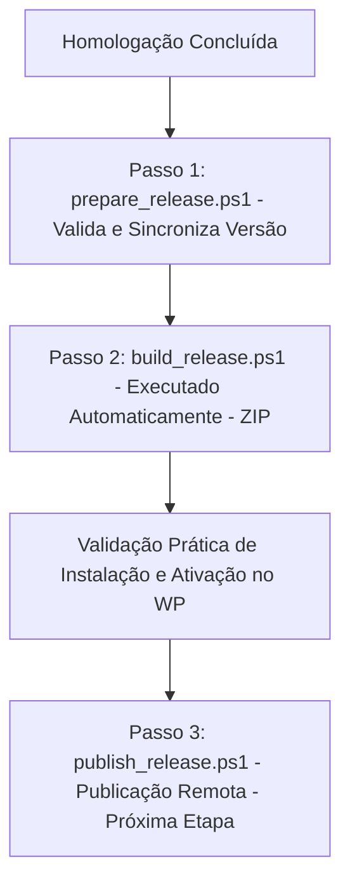

# Processo de Release (Release Process Manual) — v2.0.1

Este manual descreve o procedimento operacional padrão para geração, validação e publicação de novas versões do plugin **Gerador de Posts (IA)**. Ele estabelece os critérios de segurança e governança para empacotamento da distribuição.

---

## 📖 Índice

1. [Visão Geral do Fluxo de Release](#-visão-geral-do-fluxo-de-release)
2. [Pipeline Oficial de Release](#-pipeline-oficial-de-release)
3. [Repository Bootstrap e Governança](#-repository-bootstrap-e-governança)
4. [Distribution Validation (Validação de Distribuição)](#-distribution-validation-validação-de-distribuição)
5. [Procedimento de Git e Tagging Semântico](#-procedimento-de-git-e-tagging-semântico)
6. [Empacotamento e Upload Manual (GitHub)](#-empacotamento-e-upload-manual-github)
7. [Matriz de Decisão de Release (GO / NO-GO)](#-matriz-de-decisão-de-release-go--no-go)

---

## 🚀 Visão Geral do Fluxo de Release

O fluxo de publicação de uma nova versão do plugin segue uma trilha linear rigorosa baseada em validações automáticas e manuais:



---

## 🛠️ Pipeline Oficial de Release

O processo de empacotamento e publicação do plugin é estruturado no **Pipeline Oficial de Release**, composto por três scripts especializados sob o princípio da responsabilidade única (SRP), garantindo reprodutibilidade completa e auditável:

| Script | Responsabilidade | Status de Homologação |
| :--- | :--- | :--- |
| **`prepare_release.ps1`** | Preparação da Release, validações sintáticas, sincronização automática de metadados, atualização da documentação técnica e coordenação do build | **Implementado e Homologado** |
| **`build_release.ps1`** | Geração do pacote ZIP oficial limpo em `build/gerador-posts-gemini.zip` | **Implementado e Homologado** |
| **`publish_release.ps1`** | Publicação da Release: commit automático, tagging Git semântico, git push origin remoto e upload do ZIP via GitHub CLI | **Implementado e Homologado** |

> [!NOTE]
> O Pipeline Oficial de Release do projeto está definitivamente concluído e homologado em todas as suas três etapas obrigatórias.

### Fluxo Operacional de Execução
O fluxo de publicação de novas versões segue obrigatoriamente a sequência de três passos:

1.  **Passo 1: Preparação:** O operador dispara ativamente o script informando a versão desejada:
    ```powershell
    powershell -ExecutionPolicy Bypass -File scripts/prepare_release.ps1 -Version X.Y.Z
    ```
    O script valida o padrão `MAJOR.MINOR.PATCH`, atualiza todos os arquivos necessários (cabeçalho, Bootstrap, README, CHANGELOG e este manual) e verifica consistências pós-build.
2.  **Passo 2: Build Automatizado:** Ao fim de sua validação, o `prepare_release.ps1` invoca e coordena automaticamente o `scripts/build_release.ps1` para gerar o arquivo compactado em `build/gerador-posts-gemini.zip` e encerra o processo de preparação.
3.  **Passo 3: Publicação:** O operador executa o script de publicação para efetivar o commit, tag, push e deploy remoto da release:
    ```powershell
    powershell -ExecutionPolicy Bypass -File scripts/publish_release.ps1
    ```

---

## 📁 Repository Bootstrap e Governança

Cada versão de release deve garantir a integridade dos metadados de governança na pasta de desenvolvimento do plugin:

*   **CHANGELOG.md:** Histórico estruturado sob o padrão "Keep a Changelog".
*   **LICENSE:** Termo de licença proprietária comercial restrita para proteção da propriedade intelectual da TD Vieira Design.
*   **CONTRIBUTING.md:** Manual de convenções Git Flow e Commits Semânticos para novos desenvolvedores.
*   **SECURITY.md:** Diretrizes de reporte confidencial de vulnerabilidades encontradas no ecossistema.
*   **Controle de Commits (Normalização):**
    *   `.gitignore`: Filtra resíduos do LocalWP, dumps SQL de backup (`backup.sql`), dumps ZIP temporários e pastas de cache de IDEs.
    *   `.gitattributes`: Normaliza quebras de linha (`* text eol=lf`) para compatibilidade perfeita entre ambientes de build Linux, macOS e Windows.

---

## 🧹 Distribution Validation (Validação de Distribuição)

O pacote de distribuição de produção enviado para instalação do cliente final deve conter **apenas** arquivos funcionais homologados. 

### 1. Arquivos Excluídos do ZIP de Produção (Exclusivos do Repositório Git)
Os seguintes arquivos são importantes para o controle de desenvolvimento no GitHub, mas **não devem** ser inseridos no zip final enviado ao cliente:
*   `.git` e subpastas.
*   `.gitignore` e `.gitattributes`.
*   `CONTRIBUTING.md` e `SECURITY.md`.
*   Quaisquer scripts utilitários Python (`.py`) ou arquivos de lote (`.bat`, `.sh`).
*   A pasta técnica `/docs` contendo este handbook e seus relatórios.

### 2. Purga de Resíduos Locais
Antes de fechar o zip, o Release Builder deve verificar se arquivos de depuração e QA gerados localmente estão isolados fora da pasta física do plugin (preferencialmente na raiz pública `/public/` do LocalWP). Esses arquivos incluem:
*   `functional_test_plan.md` e `functional_test_report.md`
*   `release_readiness_report.md` ou `release_certification_report.md`
*   `autologin.php` (script de bypass de login local)

### 3. Validação Prática de Instalação e Ativação no WordPress
Como critério obrigatório e intransponível de homologação, o Release Builder deve testar fisicamente o pacote ZIP final gerado em `build/gerador-posts-gemini.zip` em um ambiente WordPress ativo (local ou sandbox), executando as seguintes ações de validação:
*   **Instalação Limpa:** Fazer o upload manual do ZIP na seção de Plugins e verificar se a instalação é concluída com sucesso.
*   **Atualização de Versão:** Instalar a versão anterior e aplicar a atualização por cima usando o novo ZIP, certificando-se de que a estrutura e opções antigas persistam no banco de dados.
*   **Ativação e Execução:** Ativar o plugin e navegar no painel administrativo. O teste deve provar que não há o erro de ativação "O arquivo do plugin não existe" e nenhuma regressão sintática ou funcional.
Nenhuma Release será homologada para publicação oficial sem preencher este requisito prático de aprovação.

---

## 🏷️ Procedimento de Git e Tagging Semântico

Com a pasta do plugin validada e limpa, executa-se a sequência de comandos Git:

```powershell
# 1. Adicionar os arquivos funcionais e de governança na branch principal
git add wp-content/plugins/gerador-posts-gemini/

# 2. Criar o commit semântico de release
git commit -m "release(v1.0.0): primeira versão oficial do Gerador de Posts (IA)"

# 3. Gerar a Tag anotada e assinada correspondente à release
git tag -a v1.0.0 -m "Release oficial v1.0.0"

# 4. Enviar os commits e a Tag para o repositório remoto oficial
git push origin master --tags
```

---

## 📦 Empacotamento e Upload Manual (GitHub)

1.  **Geração do ZIP de Produção:**
    *   O ZIP deve ser gerado de forma totalmente automatizada rodando o script de build contido no repositório. Abra o console do PowerShell na raiz do projeto e execute:
        ```powershell
        powershell -ExecutionPolicy Bypass -File scripts/build_release.ps1
        ```
    *   O ZIP será criado de forma limpa sob a pasta `build/` contendo unicamente a pasta do plugin `/gerador-posts-gemini/` e seus subdiretórios de produção. É terminantemente proibido manter ou gerar arquivos ZIP na raiz do repositório.
    *   Caminho de saída: `build/gerador-posts-gemini.zip`.
2.  **Upload e Publicação Remota:**
    *   Como tokens locais de CLI (`gh`) podem expirar ou não estar configurados no terminal de desenvolvimento local, a publicação final deve ser complementada manualmente no painel do GitHub.
    *   Acesse: `https://github.com/tdvie/gerador_posts/releases/new`.
    *   Selecione a tag **`v2.0.1`** criada via Git.
    *   Configure o título como `v2.0.1` e copie as notas de alteração do `CHANGELOG.md` na descrição.
    *   Arraste e anexe o arquivo compactado `build/gerador-posts-gemini.zip` gerado.
    *   Clique em **Publish release**.

---

## 🚦 Matriz de Decisão de Release (GO / NO-GO)

O encerramento da release e liberação de pacotes comerciais seguem a classificação abaixo:

### 🟢 GO (Aprovado sem restrições)
*   **Critérios:** 100% dos testes funcionais com sucesso. Ausência total de erros sintáticos, vulnerabilidades ativas (SSRF mitigado, Nonce e Capabilities ativos). Processamento de imagem WebP e crop funcionando perfeitamente em homologação.
*   **Ação:** Disparar tagging, push e upload do ZIP.

### 🟡 GO COM RESSALVAS (Aprovado com ações corretivas complementares)
*   **Critérios:** O software atende 100% aos requisitos de qualidade lógica e de segurança do WordPress, mas etapas de infraestrutura externa de rede de desenvolvimento impedem a automatização total (ex: ausência de token de API GitHub CLI para upload do ZIP no terminal, dependendo de upload manual via navegador).
*   **Ação:** Finalizar manualmente o processo e registrar a ressalva de ambiente nos relatórios de execução da release.

### 🔴 NO-GO (Publicação abortada)
*   **Critérios:** Qualquer uma das seguintes condições suspende a release:
    *   Falhas de Nonce ou permissão administrativa em endpoints AJAX.
    *   Desativação permanente da validação SSL (`sslverify = false`) fora de ambientes locais.
    *   Vulnerabilidade ativa de SSRF no download de imagens.
    *   Falha em testes funcionais primários (ex: erro 500 no salvamento do post).
    *   Erros de lint críticos (ex: `SyntaxError` ou `FatalError`) in PHP/JS.
*   **Ação:** Cancelar o ciclo de build, reverter tags criadas localmente e retornar a tarefa para a fase de implementação.
