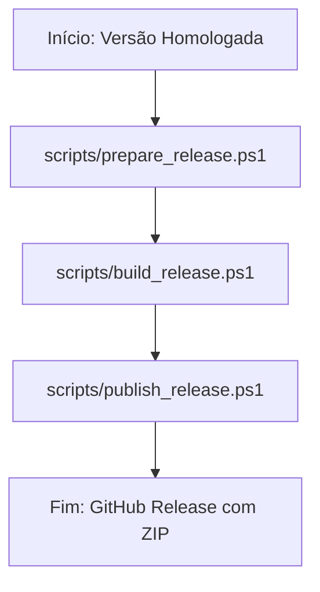

# Relatório de Consolidação do Pipeline Oficial de Release — v1.0.0

Este relatório documenta as ações para consolidação do fluxo de publicações do plugin **Gerador de Posts (IA)** sob a nomenclatura e arquitetura definitivas do **Pipeline Oficial de Release**.

---

## 📁 1. Arquivos Modificados e Criados

Os seguintes recursos foram ajustados para alinhamento e consistência arquitetural:

1.  **[scripts/prepare_release.ps1](scripts/prepare_release.ps1) (Modificado):** Adicionado bloco formal de documentação de ajuda contendo a descrição de responsabilidades unificadas do script.
2.  **[README.md](README.md) (Modificado):** Seção de release reestruturada sob o fluxo operacional em 3 passos e nomenclatura oficializada.
3.  **[docs/releases/RELEASE_PROCESS.md](docs/releases/RELEASE_PROCESS.md) (Modificado):** Totalmente revisado para unificar a nomenclatura e detalhar o pipeline composto pelas três etapas estruturadas.
4.  **[.agents/rules/project-governance.md](.agents/rules/project-governance.md) (Modificado):** Criado o Princípio 17 oficializando a obrigatoriedade de releases seguirem linearmente as três etapas sequenciais (Prepare -> Build -> Publish), proibindo qualquer deploy manual alternativo.
5.  **[docs/releases/release_preparation_script_report.md](docs/releases/release_preparation_script_report.md) (Modificado):** Expurgadas todas as ocorrências de terminologia legada ("Modular de Release"), consolidando a consistência documental global.

---

## 🏛️ 2. Arquitetura Definitiva do Pipeline Oficial de Release

A arquitetura final é desenhada como um fluxo estritamente linear em 3 etapas sequenciais:



### Tabela Oficial de Responsabilidades
A divisão funcional de responsabilidades do Pipeline Oficial de Release é normatizada conforme segue:

| Script | Responsabilidade Técnica | Status de Homologação |
| :--- | :--- | :--- |
| **`prepare_release.ps1`** | Preparação da Release: lints sintáticos, sincronização de metadados, atualização de documentações, changelogs e validações de consistência | **Implementado e Homologado** |
| **`build_release.ps1`** | Geração do pacote ZIP oficial de distribuição contendo a pasta de slug raiz `/gerador-posts-gemini/` | **Implementado e Homologado** |
| **`publish_release.ps1`** | Publicação da Release: tagging do Git, push origin remoto e upload do pacote de distribuição no GitHub (Próxima Etapa) | **Não Implementado (Próxima Etapa do Pipeline)** |

---

## ⚙️ 3. Fluxo Operacional e Exemplos de Execução

O fluxo de publicação segue rigorosamente os três passos abaixo:

*   **Passo 1:** Execução ativa do script de preparação especificando a versão semântica:
    ```powershell
    powershell -ExecutionPolicy Bypass -File scripts/prepare_release.ps1 -Version 2.0.1
    ```
*   **Passo 2:** Geração do ZIP de distribuição (`build/gerador-posts-gemini.zip`) executada automaticamente pelo `prepare_release.ps1` ao invocar o `build_release.ps1`.
*   **Passo 3 (Próxima Etapa):** Publicação automatizada de tags e pacotes no GitHub, a ser gerenciada no futuro pelo script `scripts/publish_release.ps1`.

---

## 🔒 4. Validação de Consistência e Prontidão Estrutural

*   **Validação Terminológica:** A busca cruzada em todo o repositório confirmou a eliminação completa de termos obsoletos, uniformizando o ecossistema documental na nomenclatura "Pipeline Oficial de Release".
*   **Prontidão para o Publish:** A nova modelagem documental e a divisão SRP de scripts garantem que a futura implementação de `scripts/publish_release.ps1` ocorra de forma plugável no fluxo atual, sem exigir refatorações em `prepare_release.ps1` ou `build_release.ps1`.

---

## 🚦 Bloco de Status do Relatório
*   **Status:** Concluído
*   **Fase:** Consolidação do Pipeline Oficial de Release
*   **Resultado:** Aprovado (Nomenclaturas Uniformizadas, Tabelas de SRP Inseridas e Governança Atualizada)
*   **Validação:** Execução do scripts/prepare_release.ps1, Varreduras Globais de Texto com Grep e Auditoria de Regras no project-governance.md
