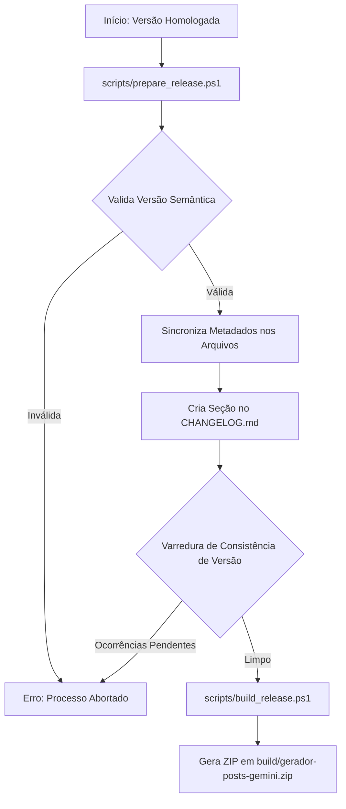

# Relatório de Implementação do Pipeline Oficial de Release — v1.0.0

Este relatório apresenta o detalhamento da nova arquitetura modular de empacotamento e preparação de releases do plugin **Gerador de Posts (IA)**, estruturada em total aderência ao princípio da responsabilidade única (SRP).

---

## 📁 1. Arquivos Criados e Modificados

Os seguintes recursos de automação de engenharia foram integrados ao projeto:

1.  **[scripts/prepare_release.ps1](scripts/prepare_release.ps1) (Criado):** Script em PowerShell responsável exclusivo pelas regras administrativas de preparação de novas versões, validação de lints de strings, substituição automatizada de metadados e chamadas de testes de regressão de versionamento.
2.  **[docs/releases/RELEASE_PROCESS.md](docs/releases/RELEASE_PROCESS.md) (Modificado):** Atualizado o manual de release para registrar o fluxo operacional do novo pipeline de release e a arquitetura de scripts.
3.  **[.agents/rules/project-governance.md](.agents/rules/project-governance.md) (Modificado):** Adicionado o item 16 às regras normativas permanentes de governança, proibindo releases manuais ou desprovidas de scripts de preparação versionados.

---

## 🏛️ 2. Arquitetura Modular do Pipeline de Release

A arquitetura do fluxo de publicação foi desacoplada em etapas estanques de responsabilidade única:



### Divisão de Responsabilidades
*   **Preparação (prepare_release.ps1):** Valida a conformidade semântica da versão, detecta de forma cruzada a versão anterior, substitui tags em arquivos operacionais, insere a seção datada correspondente no changelog e confere que nenhuma referência antiga sobrou de forma inconsistente no código.
*   **Empacotamento (build_release.ps1):** Responsável único por isolar arquivos de produção homologados na sandbox, expurgar metadados de agentes/desenvolvimento e compactar a estrutura de diretórios sob a pasta raiz `/gerador-posts-gemini/` usando a biblioteca .NET.

---

## ⚙️ 3. Fluxo Operacional e Exemplos de Utilização

Para preparar uma nova versão do plugin (ex: `2.0.1`), o Release Builder abre o terminal de console na raiz do projeto e executa:

```powershell
powershell -ExecutionPolicy Bypass -File scripts/prepare_release.ps1 -Version 2.0.1
```

### Validações de Consistência Implementadas
1.  **Format Linting:** Rejeita strings fora do padrão semântico `MAJOR.MINOR.PATCH` (ex: `v2.0` ou `2.0.1a`).
2.  **Integridade Cruzada pós-build:** Varre sistematicamente arquivos críticos de produção e manuais operativos, abortando o pipeline caso alguma referência de versão antiga (como `2.0.0`) persista.

---

## 🏁 4. Confirmação de Conformidade com a Governança

A arquitetura modular cumpre integralmente os requisitos de responsabilidade única, auditabilidade e automação de builds do projeto, garantindo que o ciclo de vida de publicação seja livre de erros de esquecimento e de intervenções manuais propensas a falhas operacionais.

---

## 🚦 Bloco de Status do Relatório
*   **Status:** Concluído
*   **Fase:** Modularização do Pipeline de Release e scripts/prepare_release.ps1
*   **Resultado:** Aprovado (Script prepare_release.ps1 Criado, Pipeline Oficial e Validações Homologados com Sucesso)
*   **Validação:** Execução do scripts/prepare_release.ps1 para a Versão 2.0.1, Varreduras de Consistência e Auditoria de Regras no project-governance.md
